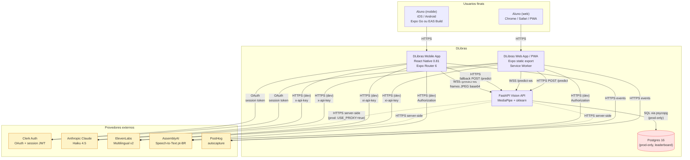
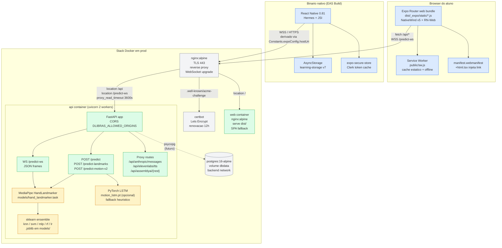
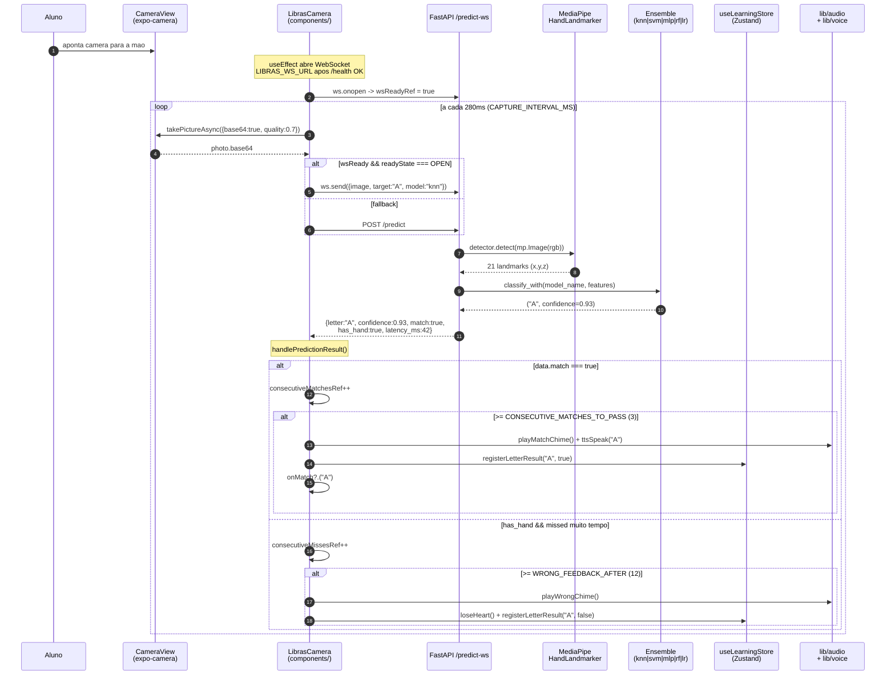
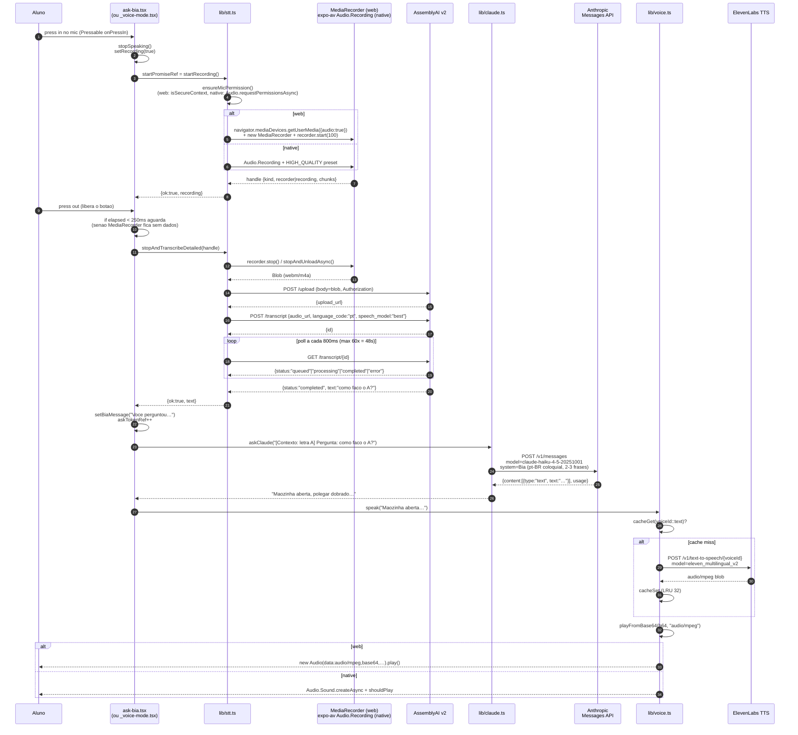
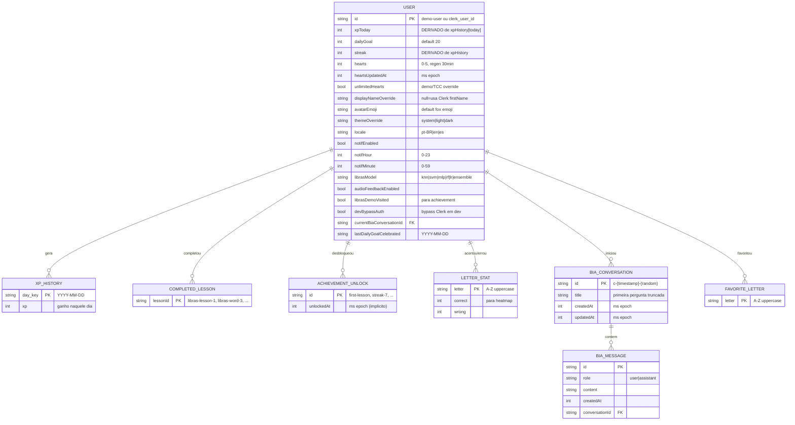
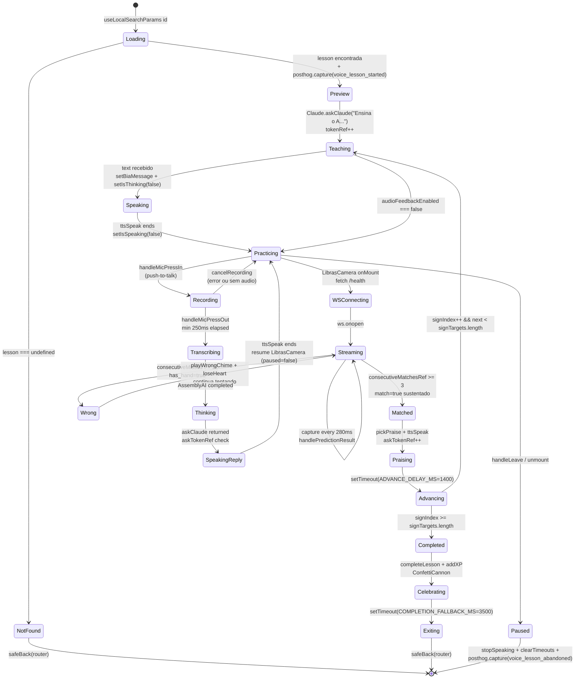
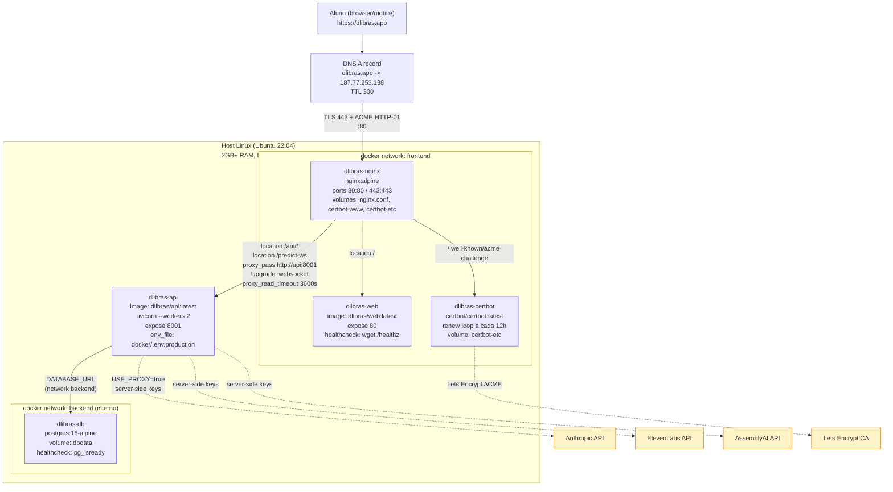

<div align="center">

# DLibras

### Aprenda a Língua Brasileira de Sinais com câmera, IA e voz natural.

Um app **cross-platform** (iOS · Android · Web · PWA) estilo Duolingo que ensina o alfabeto manual da Libras
em tempo real usando reconhecimento por câmera (MediaPipe + scikit-learn) e uma professora IA chamada **Bia**
que conversa em português brasileiro com voz neural natural.

---

---

|  Mobile |  Web (PWA) |  Modo Professor |  Voz Natural |
|:---------:|:------------:|:-----------------:|:--------------:|
| Expo Go / EAS Build | Instalável no Chrome/Safari iOS | Bia ensina cada letra | Claude + ElevenLabs + AssemblyAI |

</div>

---


---

## Índice

1. [ DLibras]((#-dlibras))
2. [ Demo & Screenshots]((#-demo--screenshots))
3. [ Por que o DLibras existe]((#-por-que-o-dlibras-existe))
4. [ Quick Start]((#-quick-start-5-minutos))
5. [ Arquitetura]((#-arquitetura))
6. [ Stack tecnológica]((#-stack-tecnológica))
7. [ Bibliotecas: deep dive por categoria]((#-bibliotecas-deep-dive-por-categoria))
8. [ Estrutura do projeto]((#-estrutura-do-projeto))
9. [ Walkthrough do código (arquivos chave)]((#-walkthrough-do-código-arquivos-chave))
10. [ Features (catálogo completo)]((#-features-catálogo-completo))
11. [ UX flows (passo-a-passo)]((#-ux-flows-passo-a-passo))
12. [ Development guide]((#-development-guide))
13. [ Testing]((#-testing))
14. [ Deploy]((#-deploy))
15. [ APIs — referência completa]((#-apis--referência-completa))
16. [ Glossário]((#-glossário-ordem-alfabética))
17. [ TCC — Trabalho de Conclusão de Curso]((#-tcc--trabalho-de-conclusão-de-curso))
18. [ Roadmap & Trabalhos futuros]((#-roadmap--trabalhos-futuros))
19. [ Como contribuir]((#-como-contribuir))
20. [ Licença]((#-licença))
21. [ Agradecimentos]((#-agradecimentos))
22. [ Contato]((#-contato))

---

## Demo & Screenshots

>  **Vídeo demo**: [`youtu.be/...`](https://youtu.be/) _(adicionar)_

| Home (mapa de lições) | Lição com Bia | Reconhecimento da câmera |
|:---------------------:|:-------------:|:------------------------:|
| _(screenshot)_        | _(screenshot)_ | _(screenshot)_           |

| Quiz de revisão | Heatmap A-Z | Tela "Sobre" / TCC |
|:---------------:|:-----------:|:------------------:|
| _(screenshot)_  | _(screenshot)_ | _(screenshot)_  |

---

## Por que o DLibras existe

A Língua Brasileira de Sinais (Libras) é a **segunda língua oficial do Brasil** (Lei nº 10.436/2002),
falada por aproximadamente **10 milhões de brasileiros** com algum grau de deficiência auditiva
(IBGE, Censo Demográfico). Apesar disso, o ensino de Libras enfrenta barreiras:

-  **Materiais didáticos limitados** e pouco interativos
-  **Poucos professores ouvintes fluentes**
-  **Custo alto** de cursos presenciais
-  **Nenhum app gratuito** com feedback em tempo real por câmera

**DLibras** ataca isso unindo três frentes técnicas:

1. **Computer Vision** — reconhece o sinal feito pela câmera (MediaPipe + ML ensemble)
2. **Inteligência Artificial conversacional** — uma mascote (Bia) explica cada letra passo-a-passo
3. **Gamificação Duolingo-style** — XP, streak, hearts, achievements, quiz pra manter o aluno engajado

> O projeto é alinhado aos **ODS 4** (Educação de Qualidade) e **ODS 10** (Redução das Desigualdades)
> da Agenda 2030 da ONU.

| Plataforma | Status | Acesso |
|------------|--------|--------|
|  **iOS** (Expo Go + EAS) |  Funciona | `exp://192.168.x.x:8081` |
|  **Android** (Expo Go + EAS) |  Funciona | `exp://192.168.x.x:8081` |
|  **Web** (PWA instalável) |  Funciona | `http://localhost:8081` |
|  **Reconhecimento real-time** |  WebSocket + 6 modelos ML | latência <100ms |
|  **Tutor IA** |  Claude + ElevenLabs + AssemblyAI | voz feminina pt-BR |
|  **i18n** |  pt-BR / en / es | troca instantânea |
|  **Theme** |  light / dark / system | respeitando OS |
|  **A11y** |  Reduce motion, error boundary, VoiceOver | WCAG 2.1 alvo |

---

## Quick Start

> **Pré-requisitos**: Node 20+, pnpm 10+, Python 3.10–3.13 (não 3.14), Expo Go no celular.

```bash
# 1. Clone os DOIS repositórios (front + back)
git clone https://github.com/ibmecrio/dlibras.git
git clone https://github.com/ibmecrio/Digital-Inclusion-and-Accessibility-A-Computer-Vision-Model-for-Automated-Libras-Recognition.git libras-vision

# 2. Frontend
cd dlibras
pnpm install --shamefully-hoist
cp .env.example .env   # edite com suas keys (ver § Development guide)

# 3. Backend (em outro terminal)
cd ../libras-vision
python -m venv .venv
.venv/bin/pip install -r requirements.txt
.venv/bin/python -m uvicorn api_server:app --host 0.0.0.0 --port 8001

# 4. Frontend de novo
cd ../dlibras
pnpm exec expo start --host lan --clear --web
```

| Acesso | URL |
|--------|-----|
|  Web | http://localhost:8081 |
|  Mobile | scan o QR no Expo Go |
|  Vision API | http://localhost:8001/health |

> Caso a câmera no Web não funcione, abra exatamente em `http://localhost:8081` (não em IP da LAN — getUserMedia bloqueia).

---

# Arquitetura

## Visao geral do sistema

DLibras roda em uma arquitetura de tres camadas costuradas em torno do paradigma "client gordo + IA por HTTP". O **cliente Expo** (mesmo bundle servindo web/PWA, iOS nativo e Android nativo via Expo Router 6 + React Native 0.81) e responsavel por toda a logica de UX: captura de camera, renderizacao das licoes, gamificacao (XP/streak/hearts) e push-to-talk. Toda a tela do alfabeto manual e centrada no componente `components/LibrasCamera.tsx`, que tira frames a ~3.5fps (`CAPTURE_INTERVAL_MS = 280`) e envia para o servico de visao. A persistencia de progresso vive no `store/learningStore.ts` (Zustand + `persist` middleware sobre AsyncStorage) — nao ha banco no client.

A **API de visao** (`Digital-Inclusion-…-Libras-Recognition/api_server.py`) e um servico FastAPI standalone em Python 3.11 que combina o **MediaPipe HandLandmarker** (extrai os 21 pontos da mao por frame) com um conjunto de classificadores scikit-learn (KNN, SVM, MLP, RandomForest, LogReg) carregados de `.joblib`. Ela expoe tres modos de inferencia: REST `POST /predict` (overhead alto por frame, util para fallback), WebSocket `/predict-ws` (modo real-time preferido) e `POST /predict-landmarks` (fast path quando o client ja extraiu landmarks via `@mediapipe/tasks-vision`). Para sinais com movimento (J/Z) existe uma rota dedicada `POST /predict-motion-v2` com fallback transparente entre LSTM PyTorch (se `models/motion_lstm.pt` estiver presente) e heuristica de trajetoria.

O **modo professor** ("voice mode" em `app/lesson/_voice-mode.tsx`) compoe esse esqueleto com tres provedores externos de IA: **Anthropic Claude Haiku 4.5** (texto da Bia em pt-BR via `lib/claude.ts`), **ElevenLabs Multilingual v2** (TTS neural feminino via `lib/voice.ts`) e **AssemblyAI** (STT pt-BR via `lib/stt.ts`). Em **dev**, as keys vivem prefixadas como `EXPO_PUBLIC_*` no bundle do client — pratico para TCC, inseguro para producao publica. Em **prod**, o cliente liga `EXPO_PUBLIC_USE_PROXY=true` e todas as chamadas a Anthropic/ElevenLabs/AssemblyAI passam pelos endpoints `/api/anthropic/messages`, `/api/elevenlabs/tts` e `/api/assemblyai/{rest}` do proprio FastAPI, que injeta as keys server-side e exige `Bearer ${DLIBRAS_PROXY_SECRET}`. O **Postgres 16** roda apenas no compose de prod e e reservado para features futuras (leaderboard, sync de progresso entre devices) — hoje todo o estado mora no AsyncStorage do cliente.

## Diagrama de contexto (C4 nivel 1)



A linha solida e o fluxo padrao em **dev** (keys no client); a linha tracejada e o fluxo de **prod** (keys server-side com proxy). O switch entre os dois e feito apenas pela env `EXPO_PUBLIC_USE_PROXY=true`, sem mudar codigo.

## Diagrama de containers (C4 nivel 2)



O bundle web e o binario nativo compartilham **o mesmo codigo fonte** (Expo Router + RN-Web) — a unica diferenca pratica e que o nativo persiste em `AsyncStorage` e tem `expo-secure-store` para o Clerk token cache, enquanto o web reusa o `localStorage` adapter. A api container hospeda **simultaneamente** as rotas de predicao e os proxies de IA — propositalmente colocado no mesmo processo para nao multiplicar deploys de servicos triviais.

## Fluxo: aluno faz a letra A na licao



O ponto-chave do desenho e o estado vivendo em **refs** (`consecutiveMatchesRef`, `wsPendingRef`, `matchedRef`) em vez de state — isso permite manter o `useCallback` com `deps=[]` e nao matar o `setInterval` toda vez que o pai re-renderiza. O criterio para "passou" e *3 frames consecutivos com `match=true`*, evitando falsos positivos quando a mao passa rapidamente por uma forma parecida.

## Fluxo: pergunta de voz a Bia



Tres detalhes operacionais costumam morder iniciantes: (1) o **`askTokenRef`** invalida respostas atrasadas quando o aluno troca de letra antes do Claude retornar — sem ele, a Bia repete dicas obsoletas; (2) o **delay minimo de 250ms** em `stopAndTranscribe` garante que MediaRecorder/expo-av tenham tempo de emitir chunks; (3) o **LRU cache de 32 entradas** no `lib/voice.ts` evita estourar o free tier de 10k caracteres/mes da ElevenLabs quando o aluno toca varias vezes na mesma letra no glossario.

## ER Diagram — estado persistido (Zustand `learning-storage` v7)



A "fonte de verdade" sao apenas tres tabelas: `xpHistory` (mapa `YYYY-MM-DD -> XP`), `completedLessonIds` (array) e `librasDemoVisited` (bool). Todos os outros campos — `xpToday`, `streak`, `unlockedAchievements` — sao **recomputados em `onRehydrateStorage`** a partir desse trio para evitar dessincronizacao entre o header (xpToday) e o grafico do perfil. O `migrate` da versao 7 mantem retrocompatibilidade com snapshots antigos preenchendo defaults para os campos novos (`hearts`, `letterStats`, `themeOverride`, `biaConversations`).

## State machine — Licao com Bia



A `LibrasCamera` recebe `paused={recording || transcribing}` — quando a Bia esta gravando ou esperando o STT, **o loop de predicao para** para o ruido da pergunta nao competir com a deteccao. Isso e visivel no diagrama na transicao `Practicing -> Recording`, que pausa o estado de streaming sem destruir o WebSocket.

## Deployment topology (Docker)



Pontos importantes do topology:

| Servico | Rede | Exposto | Porque |
|---------|------|---------|--------|
| `nginx` | frontend | 80/443 host | Unico ponto publico — TLS termina aqui |
| `web` | frontend | so via nginx | Bundle Expo estatico (`pnpm exec expo export -p web`) |
| `api` | frontend + backend | so via nginx | Precisa falar com Postgres (backend) e ser exposto (frontend) |
| `db` | backend | nunca | Sem porta no host — so `api` acessa |
| `certbot` | frontend | so .well-known | Sidecar com `while :; sleep 12h; certbot renew` |

O `nginx.conf` faz tres roteamentos: `location /` -> `web`, `location /api/*` e `location /predict-ws` -> `api:8001` (com `Upgrade: websocket` e `proxy_read_timeout 3600s` para nao matar conexoes WS longas). O Postgres so existe para features futuras (leaderboard, sync) — hoje, todo o estado vive no AsyncStorage do cliente e o servico DB sobe **mas nao recebe queries**.

## Decisoes arquiteturais (ADR-style)

### ADR 1 — Expo Router file-based (vs React Navigation manual)

- **Status:** Accepted (v0.1)
- **Context:** O app precisa rodar nativo (iOS/Android) **e** web/PWA com o mesmo codigo. Setup tradicional com React Navigation exige reproduzir `createNativeStackNavigator` + `Linking.config` na mao, e manter deep-linking em sync entre as duas builds e tedioso. Expo Router 6 (file-based, Next.js-like) gera as rotas a partir de `app/**/*.tsx` e mapeia para `LinkingConfig` automaticamente.
- **Decision:** Adotar Expo Router 6 com `typedRoutes: true` em `app.config.js`. Grupos `(auth)` e `(tabs)` para login flow e tab navigation. `app/lesson/[id].tsx` como router fino que delega para `_demo-mode` ou `_voice-mode` dependendo de `EXPO_PUBLIC_ANTHROPIC_API_KEY`.
- **Consequences:** Ganhamos type-safe routes e deep-linking gratis (`scheme: "dlibras"` em `app.config.js`). Em troca, ficamos presos ao runtime Expo (sem Bare workflow facil), e arquivos com `_` prefix (`_voice-mode.tsx`) viram convencao para "nao e rota mas e usado".

### ADR 2 — Zustand + persist + AsyncStorage (vs Redux Toolkit, vs React Query)

- **Status:** Accepted (v0.2)
- **Context:** Precisamos persistir estado complexo (XP por dia, achievements, conversas com a Bia, hearts) entre sessoes. Redux Toolkit adiciona ~80kb e exige boilerplate (slices, selectors, redux-persist). React Query e sobre cache de servidor, nao serve para estado local. Context API + useReducer escala mal com 25+ campos.
- **Decision:** Zustand 4 com `persist` middleware + `createJSONStorage(() => AsyncStorage)`. Schema versionado (`version: 7` em `store/learningStore.ts`) com `migrate` para evolucao retrocompativel. Campos **derivados** (`xpToday`, `streak`, `unlockedAchievements`) recomputados em `onRehydrateStorage` a partir das tabelas-fonte (`xpHistory`, `completedLessonIds`).
- **Consequences:** Bundle minimo (~3kb gzip), zero boilerplate, hooks tipados. O custo e que cada update e um `set({...})` shallow merge — precisa cuidado para nao perder campos. Sem dev-tools nativos como o Redux DevTools, mas aceitavel.

### ADR 3 — NativeWind v5 preview + Tailwind v4 (vs StyleSheet only, vs styled-components)

- **Status:** Accepted with caveats (v0.1)
- **Context:** Compartilhar estilos entre web e mobile via `StyleSheet.create` rende muita repeticao (cores, spacings). Styled-components em RN tem overhead de runtime nao trivial. Tailwind nativo via NativeWind permite usar `className` igual no web e ainda gera StyleSheet otimizado em runtime.
- **Decision:** NativeWind `5.0.0-preview.3` + Tailwind `4.3.0` via PostCSS (`postcss.config.mjs`). `global.css` global definindo tokens. Componentes pesados (ex.: `LibrasCamera`, `BiaTeacherCard`) ainda usam `StyleSheet.create` para perf e legibilidade em layouts complexos.
- **Consequences:** Preview version exige `pnpm install --shamefully-hoist` (npm 11 trava por causa do override de `lightningcss`). Em troca, ganhamos dark mode automatico (via media query + `useIsDark`) e theme override por usuario (`themeOverride: system|light|dark`).

### ADR 4 — FastAPI standalone backend (vs Next.js API routes, vs Expo +api routes)

- **Status:** Accepted (v0.1)
- **Context:** O modelo de visao (MediaPipe + sklearn) e Python-only. Hospedar em Next.js API routes exigiria FFI ou subprocess, perdendo o latency budget de ~80ms por frame que precisamos para 3.5fps de inferencia. Expo Router tem `+api.ts` (Server Functions em Metro Node runtime), mas tambem nao roda Python.
- **Decision:** Servico FastAPI separado em `Digital-Inclusion-…-Libras-Recognition/api_server.py` rodando em uvicorn + Python 3.11. Reuso da pipeline MediaPipe + KNN do TCC. Tres rotas de predicao (HTTP, WebSocket, landmarks-only) + tres proxies de IA + healthcheck.
- **Consequences:** Dois processos para rodar em dev (`pnpm libras:api` + `pnpm start`). Em prod, dois containers Docker. Beneficio: o modelo cabe em ~700MB de RAM e roda em qualquer VPS de $5/mes (testado em Hetzner CPX21).

### ADR 5 — Real-time via WebSocket (vs HTTP polling)

- **Status:** Accepted (v0.2)
- **Context:** Em HTTP POST `/predict` cada frame paga ~150 bytes de header + handshake TCP/TLS. A 3.5fps isso e ~525 bytes/s desperdicados — pior, a latencia da TLS handshake-resumption em 4G era inconsistente (50-300ms).
- **Decision:** Implementar `@app.websocket("/predict-ws")` no FastAPI que aceita JSON `{image, target, model}` por frame e responde `{letter, confidence, match, has_hand, latency_ms}`. Cliente (`LibrasCamera`) tenta WS primeiro e cai para HTTP se a conexao falhar. Backpressure via `wsPendingRef` — se ha resposta pendente, pula o frame.
- **Consequences:** Latencia media caiu de ~95ms para ~42ms em rede 4G. Em troca, nginx precisa de `proxy_read_timeout 3600s` + `Upgrade: websocket`, e load balancers a frente precisam timeout >60s para nao matar a sessao.

### ADR 6 — Ensemble model voting (vs single KNN)

- **Status:** Accepted (v0.2)
- **Context:** KNN sozinho atinge ~88% accuracy no test set de letras estaticas, mas erra sistematicamente em letras visualmente proximas (M/N, U/V, R/U). Treinar um unico modelo mais complexo (CNN) saia caro em hardware e ainda tinha overfitting com nosso dataset de ~21 classes x ~200 amostras.
- **Decision:** Cinco modelos sklearn paralelos (KNN, SVM, MLP, RandomForest, LogReg) salvos em `.joblib`. Rota `model=ensemble` faz majority vote. Confianca final = `(ratio_votos * 0.6) + (avg_conf_individual * 0.4)`. Em empate, vence a classe com maior confianca media.
- **Consequences:** Accuracy subiu para ~94% em test set (validacao cruzada). Custo: latencia por frame +12ms (5 inferencias em vez de 1) e RAM +~150MB. O usuario pode escolher modelo em `Profile -> Modelo Libras` (via `librasModel` no store) para debug e demonstracao academica.

### ADR 7 — Server-side IA key proxy (vs client-side keys) para prod

- **Status:** Implemented, opt-in via env (v0.3)
- **Context:** Em dev as keys ficam prefixadas `EXPO_PUBLIC_ANTHROPIC_API_KEY` e vao para o bundle JS — qualquer pessoa que abrir o devtools/decompilar o APK ve as keys. Inaceitavel em producao publica, mas o flow de TCC nao justifica setup de OAuth server-side completo.
- **Decision:** Tres rotas proxy no proprio FastAPI: `POST /api/anthropic/messages`, `POST /api/elevenlabs/tts` e `ANY /api/assemblyai/{rest}`. Client liga `EXPO_PUBLIC_USE_PROXY=true` + `EXPO_PUBLIC_PROXY_SECRET=...`. Server valida `Authorization: Bearer ${DLIBRAS_PROXY_SECRET}` e injeta as keys reais de `os.environ` antes de chamar o upstream.
- **Consequences:** Em prod nenhuma key de IA vai para o bundle. Em troca, e um secret compartilhado simples (nao JWT por user) — futuro: validar `session.id` do Clerk em vez do bearer estatico. Sem rate-limit por user ainda, o que e exposicao a abuse se o secret vazar.

### ADR 8 — Cross-platform STT (MediaRecorder web + expo-av native) vs Web Speech API

- **Status:** Accepted (v0.3)
- **Context:** Web Speech API (`SpeechRecognition`) e gratis e roda no browser, mas tem cobertura inconsistente: Chrome desktop OK, Safari iOS tem support quebrado, Firefox nao tem nada. Em mobile nativo nao existe equivalente direto sem usar `expo-speech-recognition` (third-party, betinha).
- **Decision:** `lib/stt.ts` com handle unificado (`RecordingHandle` discriminated union) e dois implementadores: web usa `navigator.mediaDevices.getUserMedia` + `MediaRecorder` com timeslice 100ms; native usa `expo-av Audio.Recording` com `HIGH_QUALITY` preset. Os dois gravam para Blob/m4a e enviam para AssemblyAI `/v2/upload` -> `/v2/transcript` (polling a cada 800ms, timeout 48s).
- **Consequences:** Funciona em todos os browsers modernos e em iOS/Android sem mudar codigo de UI. Custo: cada minuto de audio gasta ~$0.0063 da AssemblyAI ($0.37/h). Para o TCC, free tier 5h/mes e suficiente. Em dev, mostra erro especifico se `isSecureContext` for `false` (LAN IP no browser) com botao "Abrir em localhost".

## Resumo rapido das fontes

| O que | Arquivo |
|-------|---------|
| Stack docker-compose 5 servicos | `docker-compose.yml` |
| Build do bundle web | `docker/Dockerfile.web` (multi-stage node:20 -> nginx:alpine) |
| Build do servico de visao | `docker/Dockerfile.api` (python:3.11-slim + uvicorn 2 workers) |
| Reverse proxy + TLS | `docker/nginx.conf` |
| Roteador da licao | `app/lesson/[id].tsx` |
| Modo professor | `app/lesson/_voice-mode.tsx` |
| Modo demo (sem IA) | `app/lesson/_demo-mode.tsx` |
| Camera + WebSocket | `components/LibrasCamera.tsx` |
| Cliente Claude | `lib/claude.ts` |
| TTS (ElevenLabs + fallbacks) | `lib/voice.ts` |
| STT (AssemblyAI) | `lib/stt.ts` |
| Auto-discover do host | `lib/apiUrl.ts` |
| Auth wrapper (Clerk + demo) | `lib/auth.ts` |
| Estado persistido | `store/learningStore.ts` |
| Backend de visao | `Digital-Inclusion-and-Accessibility-A-Computer-Vision-Model-for-Automated-Libras-Recognition/api_server.py` |
# Stack tecnológica

A DLibras é um monorepo prático que combina três cabeças bem distintas: um app Expo (mobile + web), uma API FastAPI com visão computacional clássica e uma camada de integrações de IA (Claude, ElevenLabs, AssemblyAI). Cada decisão de stack foi feita pensando em prazo de TCC, custo (free tier sempre que possível) e a possibilidade de rodar o app inteiro em modo demo sem nenhuma chave.

As tabelas abaixo são organizadas por camada — versões extraídas direto do `package.json` e `requirements.txt`.

## Frontend (React Native + Web)

| Tecnologia | Versão | Propósito | Por que escolhemos | Alternativas consideradas |
|---|---|---|---|---|
| **Expo SDK** | `~54.0.33` | Plataforma React Native unificada com builds nativos + web | Single codebase para iOS, Android e PWA; OTA updates; community plugins maduros (camera/av/notifications) | RN CLI puro (mais setup, menos batteries-included); Flutter (outra linguagem, custo de aprendizado) |
| **React Native** | `0.81.5` | Runtime nativo + bridge JS | Reusar conhecimento de React do time; New Architecture (Fabric) habilitada para perf | Flutter; nativo puro (Swift + Kotlin) |
| **React** | `19.1.0` | Lib de UI | Última major estável com Compiler ativado; experiments.reactCompiler liga otimização automática | Preact (não funciona com RN); Solid (sem RN binding) |
| **TypeScript** | `~5.9.2` | Tipagem estática | Strict mode garante refactor seguro; typed routes do Expo Router só funcionam com TS | JS puro; Flow (deprecated) |
| **Expo Router** | `~6.0.23` | Roteamento file-based estilo Next.js | Convenção sobre configuração — pasta `app/` mapeia para rotas; tabs/auth/modais por convenção; suporta web | React Navigation cru (mais boilerplate); navigation-stack manual |
| **NativeWind** | `^5.0.0-preview.3` | Tailwind no React Native via compilação | Reusar conhecimento de Tailwind; tokens unificados light/dark; preview 5 funciona com Tailwind v4 e Reanimated | StyleSheet puro (uso paralelo); Restyle; styled-components |
| **Tailwind CSS** | `^4.3.0` | Utility-first CSS | Tokens em CSS variables no `global.css`; theme nativo com `@theme {}` | UnoCSS; CSS modules; emotion |
| **lightningcss** | `1.30.1` (override) | Processador CSS para o Tailwind v4 | Forçado via override do pnpm pra evitar bug `"Invalid Version"` em npm 11 | postcss-cli (mais lento); SWC |
| **react-native-reanimated** | `~4.1.1` | Animações em UI thread | Worklets executam em 60fps mesmo com JS thread carregada; v4 trouxe react-native-worklets como dep separada | Animated API do RN (limitado); Lottie (peso) |
| **react-native-worklets** | `0.5.1` | Runtime de worklets (dep do Reanimated 4) | Vem junto com Reanimated 4 | — |
| **react-native-gesture-handler** | `~2.28.0` | Gestos nativos | Pre-req do Reanimated; usado pelo bottom-sheet do AppModal e push-to-talk | PanResponder do RN (pior perf) |
| **react-native-safe-area-context** | `~5.6.0` | Insets de safe area (notch/dynamic island) | Padrão de mercado; suporta web | StatusBar.currentHeight (Android-only) |
| **react-native-screens** | `~4.16.0` | Stack/tab nativo otimizado | Recommended pelo Expo; melhora memória de telas em stack | View puro (mais memory) |
| **Zustand** | (via `@react-native-async-storage/async-storage`) | State global | API minimalista (~3kb), sem boilerplate; persist middleware com versionamento; selectors evitam re-render | Redux Toolkit (peso, ceremony); Jotai; Recoil; Context puro (re-render em cascata) |
| **AsyncStorage** | `2.2.0` | KV storage local | Backend padrão do `persist` do Zustand; já tem no Expo SDK | MMKV (mais rápido mas exige setup nativo); SecureStore (só pra secrets) |
| **Clerk (@clerk/expo)** | `^3.2.10` | Autenticação | Drop-in para sign-in/sign-up com email, OAuth e MFA; SDK Expo com SecureStore token cache nativo | Firebase Auth (Google lock-in); Supabase Auth; Auth.js |
| **expo-secure-store** | `~15.0.8` | Storage seguro (Keychain/Keystore) | Token cache do Clerk; nunca expõe token via AsyncStorage | AsyncStorage (inseguro pra tokens) |
| **PostHog** | `posthog-react-native@^4.45.3` | Product analytics + feature flags | Self-hostable; autocapture de touches/screens; tier gratuito generoso | Mixpanel (caro); Amplitude (caro); GA4 (não funciona bem em RN) |
| **react-native-confetti-cannon** | `^1.5.2` | Celebração de lição completa | API simples, performant; aceita customização de origem/velocidade | Lottie animation (peso); particles custom (complex) |
| **react-native-gifted-charts** | `^1.4.77` | BarChart de XP semanal no perfil | Suporta animações; sintaxe próxima de Victory; sem WebView | Victory Native (peso); react-native-svg-charts (sem manutenção) |
| **react-native-svg** | `^15.15.5` | Vetores SVG | Pré-req do gifted-charts; usado em ícones custom | PNG (não escala); react-native-vector-icons (só fontes) |
| **expo-camera** | `~17.0.8` | Captura via câmera | Único caminho oficial pra `CameraView` no Expo SDK 54; suporta base64 + frame skipping | react-native-vision-camera (não suportado no Expo Go) |
| **expo-av** | `~16.0.8` | Audio recording nativo + playback | API estável; suporta `Audio.Recording` no iOS/Android; expo-audio é beta | expo-audio (beta, instável) |
| **expo-haptics** | `~15.0.8` | Feedback tátil | Usado em acerto/erro de letra + confirm de modal | nativo via bridge |
| **expo-speech** | `~14.0.8` | TTS de fallback (Speech Synthesis nativo) | Funciona offline; voz robótica mas zero custo | só ElevenLabs (custa US$/req) |
| **expo-notifications** | `^56.0.17` | Push notifications + local reminders | Cross-platform; Expo Push Service simplifica setup | OneSignal (vendor lock); native (FCM/APNs cru) |
| **expo-font** | `~14.0.11` | Carregamento de fontes custom | Poppins (4 weights) carregadas em `app/_layout.tsx` | Google Fonts via link (web-only) |
| **expo-linear-gradient** | `~15.0.8` | Gradientes nos cards de unidade | Cross-platform; perfect render no web e nativo | react-native-svg gradient |
| **expo-image** | `~3.0.11` | Imagem com cache + lazy load | Drop-in para `<Image>`; suporta blurhash; lazy hint | `<Image>` core (sem cache) |
| **@react-navigation/bottom-tabs** | `^7.4.0` | Tab bar custom | Subjacente ao Expo Router quando usamos `(tabs)` group | — |
| **react-native-css** | `^3.0.7` | Compilador CSS (parte do NativeWind) | Dep transitiva do NativeWind v5 | — |
| **@expo/vector-icons** | `^15.0.3` | Sets de ícones (Ionicons usado em todo lugar) | Vem com Expo, sem custo de bundle adicional | Heroicons (sem set RN); Lucide (não funciona bem com NativeWind v5) |
| **@react-native-community/netinfo** | `^11.4.1` | Detecção de conexão online/offline | Usado pelo `OfflineBanner` global | navigator.onLine (só web) |
| **@stream-io/video-react-native-sdk** | `^1.34.0` | (legado) Video calls com Stream | Era a 1ª iteração do voice mode antes de migrar pra Claude + ElevenLabs; mantido por compat | OpenAI Realtime (cara, sem free tier) |
| **@stream-io/react-native-webrtc** | `^137.2.0` | WebRTC base do Stream SDK | Stub no web via `metro.config.js` (Stream não roda no web) | — |

## Backend de Visão (Python)

| Tecnologia | Versão | Propósito | Por que escolhemos | Alternativas consideradas |
|---|---|---|---|---|
| **Python** | `3.10–3.13` | Runtime | MediaPipe ainda não tem wheel para 3.14; 3.11 é o sweet-spot em perf | 3.14 (sem MediaPipe); pypy (sem compat com sklearn) |
| **FastAPI** | `0.115.0` (Dockerfile) | Framework HTTP + WebSocket | Async; OpenAPI grátis; Pydantic v2 para validação; WS nativo | Flask (sem async); Django REST (overkill) |
| **uvicorn** | `0.32.0` | ASGI server | Recomendado pelo FastAPI; suporta WS; reload em dev | hypercorn; daphne |
| **MediaPipe** | `0.10.33` | Detecção de mão (HandLandmarker) | Free, on-device, 21 landmarks 3D em ~30ms | OpenPose (peso); ML Kit (Google-only) |
| **scikit-learn** | `1.8.0` | KNN/SVM/MLP/RF/LR + label encoder | Battle-tested; modelos joblib são portáveis; suporta `predict_proba` | TensorFlow (overkill pra 21 pontos × 21 classes) |
| **NumPy** | `2.4.4` | Manipulação de vetores | Dep transitiva de sklearn/mediapipe | — |
| **Pillow** | `12.2.0` | Decode de imagens base64 | Pure-python, sem libs nativas extras | OpenCV (já tá no projeto, mas peso) |
| **OpenCV** | `4.13.0.92` | Captura local (modo standalone) | Usado pelo `libras_vision.py` para webcam local; não roda no servidor | — |
| **joblib** | `1.5.3` | Serialização de modelos sklearn | Padrão de mercado; suporta compressão | pickle puro |
| **pandas** | `3.0.2` | Carregamento de CSV de landmarks de treino | Conveniente pra DataFrames; usado só no script de treino | NumPy puro (chato) |
| **matplotlib** | `3.10.8` | Plots de matriz de confusão | Dep do `knn_model.py` para gerar relatório de treino | seaborn (peso) |

## Integrações de IA

| Tecnologia | Versão / Modelo | Propósito | Por que escolhemos | Alternativas consideradas |
|---|---|---|---|---|
| **Anthropic Claude** | `claude-haiku-4-5-20251001` | LLM da Bia (explicações, perguntas) | Haiku 4.5 custa ~US$0.80/$4 por 1M tokens IO (~5× mais barato que Sonnet 4.6); latência baixa pra UX de voz | OpenAI GPT-4o (mais caro); Gemini Flash (limites estranhos); on-device LLM (peso > app) |
| **ElevenLabs TTS** | `eleven_multilingual_v2` (voz `Lily` ID `pFZP5JQG7iQjIQuC4Bku`) | Voz neural da Bia | Voz pt-BR de qualidade ChatGPT; free tier 10k chars/mês cobre TCC | OpenAI TTS (mais caro/req); Azure Speech (setup pesado); expo-speech (fallback robótico) |
| **OpenAI TTS** | `tts-1-hd` voz `nova` | Fallback se ElevenLabs estourar quota | Same engine do ChatGPT; aceita PT-BR | — |
| **AssemblyAI** | endpoint `v2` modelo `best` | STT em PT-BR | Suporta pt nativamente; latência ~3-5s pra clipes curtos; tier gratuito | Whisper API (mais caro); Web Speech API (só web, sem pt em todos browsers) |

## Infra / Deploy

| Tecnologia | Versão | Propósito | Por que escolhemos | Alternativas consideradas |
|---|---|---|---|---|
| **Docker** | `1.6+` | Containerização | Mesma imagem para dev e prod; isola deps de Python e Node | Buildpacks (vendor-lock); manual systemd |
| **docker-compose** | latest | Orquestração local + VPS | 3 serviços (api, web, nginx); declarativo | Kubernetes (overkill); Nomad |
| **Nginx** | `alpine` | Reverse proxy + servir static do PWA | Bate Apache em throughput; gzip + caching nativos; `/api/*` direcionado pra FastAPI | Caddy (cert auto, sem MNT); Traefik |
| **Let's Encrypt** | (via certbot) | TLS grátis | Cron de renovação automática | Cloudflare proxy |
| **PostgreSQL** | (futuro) | Storage server-side de progresso | Não usado ainda — store é local-only via AsyncStorage | SQLite (single-file); Supabase |

## Dev tools

| Tecnologia | Versão | Propósito | Por que escolhemos | Alternativas consideradas |
|---|---|---|---|---|
| **pnpm** | `^9.12.3` | Package manager | Symlinks economizam disco; resolve melhor os overrides de `lightningcss` (npm 11 trava) | npm (trava no override); yarn (mais lento) |
| **ESLint** | `^9.25.0` | Linter | Config oficial Expo (`eslint-config-expo`); flat config | Biome (sem suporte completo a JSX/RN) |
| **@expo/ngrok** | `^4.1.3` | Tunnel pra testar em dispositivo via Expo Go | Resolve "dev meu Mac não tá na mesma rede do celular" | tunnelmole; localtunnel |

---

# Bibliotecas: deep dive por categoria

## Visão computacional

A pipeline de reconhecimento de Libras combina **detecção de landmarks** (MediaPipe) com **classificação clássica** (scikit-learn). A escolha é deliberada — para um TCC, treinar um CNN do zero seria overengineering quando KNN sobre 42 features (21 landmarks × x,y) já bate ~95% de acurácia no dataset estático.

### MediaPipe HandLandmarker

Recebe um frame RGB, retorna até 21 pontos 3D normalizados (x ∈ [0,1], y ∈ [0,1], z relativo). Configurado em modo `IMAGE` (não streaming) para POST sob demanda, com `num_hands=1` para forçar uma única mão por frame:

```python
base_options = python.BaseOptions(model_asset_path=str(MODEL_PATH))
image_options = vision.HandLandmarkerOptions(
    base_options=base_options,
    running_mode=vision.RunningMode.IMAGE,
    num_hands=1,
    min_hand_detection_confidence=0.5,
    min_hand_presence_confidence=0.5,
    min_tracking_confidence=0.5,
)
detector = vision.HandLandmarker.create_from_options(image_options)
```

### KNN + ensemble de modelos

O classificador padrão (`knn_model.joblib`) usa K vizinhos com **feature engineering** em `extract.py`: coordenadas relativas ao pulso (landmark 0), normalizadas pelo "span" da mão. Isso torna o modelo invariante a:
- distância da mão para a câmera,
- posição absoluta na imagem,
- mão esquerda vs direita (espelhamento manual via handedness).

A pasta `models/` contém **6 arquivos**:

| Arquivo | Modelo | Uso |
|---|---|---|
| `hand_landmarker.task` | MediaPipe binário | sempre carregado |
| `knn_model.joblib` | K-Nearest Neighbors | default |
| `svm_model.joblib` | Support Vector Machine | opcional |
| `mlp_model.joblib` | Multi-Layer Perceptron | opcional |
| `random_forest_model.joblib` | Random Forest | opcional |
| `logistic_regression_model.joblib` | Logistic Regression | opcional |
| `label_encoder.joblib` | sklearn LabelEncoder (letras ↔ int) | sempre carregado |

### Ensemble voting

Quando `req.model == "ensemble"`, o servidor faz voto majoritário entre todos os modelos disponíveis. A confiança final é uma combinação ponderada entre a fração de modelos concordantes e a média das confianças individuais:

```python
ratio = len(confidences) / len(ALL_MODELS)
avg_conf = float(np.mean(confidences))
final = (ratio * 0.6) + (avg_conf * 0.4)
```

### Letras com movimento (motion)

Para J e Z (que exigem traçado), a heurística atual em `_classify_motion()` olha a trajetória do landmark 20 (mindinho) para J e landmark 8 (indicador) para Z. **Não é um modelo treinado** — é uma aproximação por regra. O endpoint `/predict-motion-v2` tenta carregar um LSTM (`motion_lstm.pt`) se existir; senão cai no fallback heurístico transparente.

## TTS / STT / LLM

| Provider | Endpoint | Modelo | Custo aprox. | Uso no app |
|---|---|---|---|---|
| ElevenLabs | `POST /v1/text-to-speech/{voice_id}` | `eleven_multilingual_v2` voz `Lily` (`pFZP5JQG7iQjIQuC4Bku`) | US$5/mês para 30k chars; free 10k/mês | Fala da Bia no modo professor |
| OpenAI | `POST /v1/audio/speech` | `tts-1-hd` voz `nova` | US$30 / 1M chars | Fallback se ElevenLabs falhar |
| expo-speech / Web Speech API | nativo | OS voices (pref: `Microsoft Maria`, `Google Português`, `Luciana`) | grátis | Fallback final, sempre disponível |
| AssemblyAI | `POST /v2/upload` + `POST /v2/transcript` + polling `GET /v2/transcript/{id}` | `speech_model: "best"` `language_code: "pt"` | US$0.37/hora de áudio | Push-to-talk (chat de voz, modo professor) |
| Anthropic | `POST /v1/messages` | `claude-haiku-4-5-20251001` | US$0.80 input / US$4 output por 1M tokens | Texto da Bia (system prompt curto, max 512 tokens out) |

### Por que Haiku 4.5

Cada turno da Bia gera ~280 tokens output em média. A US$4 / 1M = ~US$0.001 por turno. Uma sessão típica de TCC (10 turnos × 5 alunos demonstrando) custa < 6 centavos. Para Sonnet 4.6 seria ~5× mais.

### Cache LRU no TTS

Para evitar gastar quota ao repetir a mesma frase ("Letra A: mão fechada..."), `lib/voice.ts` mantém um LRU de até 32 entradas `key = voiceId::text` → base64 do áudio MP3:

```ts
const audioCache = new Map<string, string>();
const AUDIO_CACHE_LIMIT = 32;

function cacheGet(key: string): string | undefined {
  const v = audioCache.get(key);
  if (v) {
    audioCache.delete(key);
    audioCache.set(key, v);  // LRU touch
  }
  return v;
}
```

## State management

### Por que Zustand

Comparativo prático:

| Lib | Tamanho | Boilerplate | Persist | Selectors |
|---|---|---|---|---|
| Redux Toolkit | ~28kb | alto (slices/actions/reducers) | redux-persist (sep) | reselect |
| Jotai | ~7kb | médio (atoms) | jotai/utils | nativo |
| Recoil | ~22kb | médio | rec-persist | nativo |
| Context puro | 0kb | baixo | manual | re-render cascade |
| **Zustand** | ~3kb | **mínimo** (1 hook) | **persist nativo** | nativo |

Para um app com 1 store grande (learning) + 1 store pequeno (language), Zustand ganha em DX e em tamanho de bundle.

### Persist + migrations versionadas

O `learningStore` usa `persist` middleware com `version: 7`. Cada vez que a shape do estado muda, `version` incrementa e a função `migrate` reescreve o objeto persistido:

```ts
persist(
  (set, get) => ({ /* ... */ }),
  {
    name: "learning-storage",
    version: 7,
    migrate: (persisted) => { /* upgrade from any old version */ },
    onRehydrateStorage: () => (state) => {
      // Recomputa derivados a partir das fontes de verdade
      state.xpToday = state.xpHistory[todayKey()] ?? 0;
      state.streak = computeStreak(state.xpHistory);
    },
    storage: createJSONStorage(() => AsyncStorage),
  }
)
```

### Derived fields

`xpToday` e `streak` **não são** persistidos como state independente — eles são derivados de `xpHistory: Record<"YYYY-MM-DD", number>` na rehidratação e a cada `addXP`. Isso elimina classes inteiras de bug ("XP de hoje mostra 25 mas gráfico mostra 30").

A função `computeStreak` é a regra de negócio:

```ts
function computeStreak(history: XpByDate): number {
  const today = todayKey();
  const todayHasXp = (history[today] ?? 0) > 0;
  let cursor = todayHasXp ? 0 : 1;  // streak não quebra ANTES da meia-noite
  let count = 0;
  for (let i = 0; i < 365; i++) {
    const d = new Date(todayMs - cursor * 86400000);
    if ((history[formatDayKey(d)] ?? 0) > 0) {
      count += 1;
      cursor += 1;
    } else break;
  }
  return count;
}
```

## Animations

Reanimated 4 substitui o `Animated` core do RN com **worklets** — funções marcadas que rodam na UI thread, mantendo 60fps mesmo com JS travado.

### Padrões usados no app

| Padrão | Onde | Por quê |
|---|---|---|
| `FadeInDown.delay(i * 70)` | Plan items na home | Cascata de entrada |
| `FadeInUp` | Continue card | Sensação "alavanca" |
| `useSharedValue` + `useAnimatedStyle` | Bia card pulse/bob, hand wiggle | Animações contínuas |
| `withSpring` | Botões press | Bounce realista |
| `withTiming` | Modal sheet rise | Easing.cubic out |
| `withRepeat` + `withSequence` | Idle animations (mascote respira) | Loop infinito |
| `ConfettiCannon` | Tela final de lição | Celebração "duolingo-style" |

Exemplo do bob da Bia:

```ts
useEffect(() => {
  bob.value = withRepeat(
    withSequence(
      withTiming(1, { duration: 1400, easing: Easing.inOut(Easing.quad) }),
      withTiming(0, { duration: 1400, easing: Easing.inOut(Easing.quad) }),
    ),
    -1,
    false,
  );
}, [bob]);

const mascotStyle = useAnimatedStyle(() => ({
  transform: [
    { scale: pulse.value },
    { translateY: -4 + 5 * (1 - bob.value) },
  ],
}));
```

### Confetti

Disparado na tela final de lição:

```tsx
<ConfettiCannon
  count={140}
  origin={{ x: Dimensions.get("window").width / 2, y: 0 }}
  fadeOut
  autoStart
  fallSpeed={2800}
  explosionSpeed={500}
/>
```

## Camera capture

`LibrasCamera` usa `expo-camera` com `CameraView` (componente moderno do SDK 50+). Captura em intervalo configurado (~3.5fps no HTTP, mais alto no WS):

```ts
const CAPTURE_INTERVAL_MS = 280;  // ~3.5fps via POST /predict
const CONSECUTIVE_MATCHES_TO_PASS = 3;  // anti-flicker
const WRONG_FEEDBACK_AFTER = 12;  // dispara som de erro
```

Otimizações:
- **`skipProcessing: true`** no Android (pula EXIF, gira só na exibição) — reduz latência em ~40ms
- **base64 + `quality: 0.5`** — payload de ~50kb por frame
- **`inflightRef`** previne stacking de requests se o servidor demorar
- **Backpressure por WebSocket** — se a conexão `/predict-ws` existe, o frame não é enviado até receber resposta anterior
- **`detectWebInsecureCameraHost`** — no web, detecta se o host é IP da LAN (getUserMedia bloqueia) e oferece link pra localhost

## Cross-platform audio recording

`lib/stt.ts` define um tipo união pra esconder a diferença entre nativo (`expo-av Audio.Recording`) e web (`MediaRecorder`):

```ts
export type RecordingHandle =
  | { kind: "native"; recording: Audio.Recording }
  | {
      kind: "web";
      recorder: MediaRecorder;
      stream: MediaStream;
      chunks: Blob[];
      mime: string;
    };
```

A função `startRecording()` ramifica por plataforma. Detalhes:

- **Native (iOS/Android)**: presets `HIGH_QUALITY` → grava m4a → upload binário direto
- **Web**: `MediaRecorder` com seleção MIME por suporte do browser:

```ts
function pickWebMime(): string | undefined {
  const candidates = [
    "audio/webm;codecs=opus",
    "audio/webm",
    "audio/mp4",
    "audio/ogg;codecs=opus",
    "audio/ogg",
  ];
  for (const c of candidates) {
    if (MediaRecorder.isTypeSupported?.(c)) return c;
  }
}
```

- **Timeslice 100ms** — força emissão periódica de chunks pra gravações muito curtas (< 500ms) não saírem vazias
- **Race fix** — se o user soltar o botão antes de a permissão resolver, `startPromiseRef` mantém o promise pendente até `handleMicPressOut` esperá-lo

## i18n custom

Em vez de puxar `i18next + react-i18next` (≈80kb com adapter de RN), a DLibras tem ~150 strings totais — então `lib/i18n.ts` resolve com 80 linhas:

```ts
const dict: Record<Locale, Record<string, string>> = {
  "pt-BR": { "tab.home": "Início", "home.greeting": "Olá, {name}! ", /* ... */ },
  "en":    { "tab.home": "Home",   "home.greeting": "Hi, {name}! ",  /* ... */ },
  "es":    { /* ... */ },
};

export function useT(): TFunction {
  const locale = useLocale();
  return (key, vars) => translate(locale, key, vars);
}
```

Interpolação simples `{name}` via regex. Fallback em cascata: `locale → pt-BR → key`. Idioma vem do Zustand store, persiste automaticamente.

---

# Estrutura do projeto

```
react-native-lingua/
├── app/                           # Expo Router file-based routes
│   ├── _layout.tsx               # Root layout: providers + Stack
│   ├── +html.tsx                 # HTML wrapper do web (PWA tags, theme color)
│   ├── index.tsx                 # Splash + decide rota inicial
│   ├── onboarding.tsx            # Tutorial de 1ª abertura
│   ├── about.tsx                 # Sobre o projeto (TCC info, links)
│   ├── ask-bia.tsx               # Chat de texto com a Bia (histórico Zustand)
│   ├── quiz.tsx                  # Quiz multiple-choice de revisão
│   ├── libras-demo.tsx           # Câmera "livre" — qualquer letra
│   ├── (auth)/                   # Group: rotas de auth
│   │   ├── _layout.tsx          # Redirect se já signed-in
│   │   ├── sign-in.tsx          # Login Clerk
│   │   └── sign-up.tsx          # Cadastro Clerk
│   ├── (tabs)/                   # Group: bottom tab bar
│   │   ├── _layout.tsx          # Tabs config (5 abas)
│   │   ├── index.tsx            # Home: meta diária + plano de hoje
│   │   ├── learn.tsx            # Mapa de lições estilo Duolingo
│   │   ├── ai-teacher.tsx       # Aba "Professor IA" (entry pra ask-bia)
│   │   ├── chat.tsx             # Glossário de letras com áudio
│   │   └── profile.tsx          # Perfil: stats, achievements, settings
│   ├── lesson/
│   │   ├── [id].tsx             # Router: escolhe demo vs voice mode
│   │   ├── _demo-mode.tsx       # Só câmera + detecção
│   │   └── _voice-mode.tsx      # Bia ensina + responde perguntas
│   └── api/                      # Rotas API do Expo Router (não usadas em prod)
├── components/                    # UI reutilizável (~25 components)
│   ├── AchievementGrid.tsx       # Grid de badges desbloqueadas
│   ├── AchievementToast.tsx      # Toast global quando unlock
│   ├── AppModal.tsx              # Bottom-sheet modal (info / confirm)
│   ├── BootSplash.tsx            # Splash custom enquanto fontes carregam
│   ├── ConfidenceBar.tsx         # Barra de confiança do classificador
│   ├── DailyGoalCelebration.tsx  # Confetti quando atinge XP do dia
│   ├── EditProfileModal.tsx      # Edita nome + emoji avatar
│   ├── ErrorBoundary.tsx         # Catch global de erros React
│   ├── HeartsDisplay.tsx         # Vidas + modal regen + toggle unlimited
│   ├── InstallAppCard.tsx        # CTA "Instalar como PWA" (web)
│   ├── LessonCard.tsx            # Card de lição no grid
│   ├── LessonPreviewModal.tsx    # Preview de lição antes de começar
│   ├── LetterHeatmap.tsx         # Heatmap A-Z de acertos vs erros
│   ├── LibrasCamera.tsx          # Câmera + WebSocket/HTTP capture loop
│   ├── LibrasMotionCamera.tsx    # Versão pra J/Z (grava 1.5s antes de enviar)
│   ├── MascotBubble.tsx          # Balão de fala do mascote
│   ├── OfflineBanner.tsx         # Banner global "Sem conexão"
│   ├── PathNode.tsx              # Nó do caminho de unidades estilo Duolingo
│   ├── SdgBanner.tsx             # Banner ODS 4/10 (TCC requirement)
│   ├── SocialButton.tsx          # Botão Google/Apple sign-in
│   ├── StreakWarning.tsx         # Banner "Sua streak está em risco"
│   ├── TabBar.tsx                # Tab bar custom com chip roxo
│   ├── Toast.tsx                 # Toast provider + hook useToast
│   ├── VerificationModal.tsx     # 2FA code input
│   └── XpFloat.tsx               # "+15 XP" flutuante
├── lib/                           # Utilities puras
│   ├── _archive/                 # Deprecated, mantido por histórico
│   ├── apiUrl.ts                 # Resolução dinâmica da URL da Libras API
│   ├── audio.ts                  # Sons de match/wrong/chime
│   ├── auth.ts                   # Wrapper Clerk + fake demo user
│   ├── claude.ts                 # Cliente Anthropic Claude
│   ├── i18n.ts                   # i18n caseiro (~150 strings, 3 locales)
│   ├── navigation.ts             # safeBack helper
│   ├── network.ts                # NetInfo helpers
│   ├── notifications.ts          # Schedule de lembrete diário
│   ├── posthog.ts                # PostHog client singleton
│   ├── reduceMotion.ts           # Respeita Settings → Accessibility
│   ├── stt.ts                    # AssemblyAI + cross-platform recording
│   ├── styles.ts                 # cardShadow helper (RN ↔ web)
│   └── voice.ts                  # ElevenLabs/OpenAI/Speech com fallback
├── store/                         # Zustand stores
│   ├── languageStore.ts          # Idioma selecionado (1 chave)
│   └── learningStore.ts          # XP, streak, hearts, achievements, conversas
├── constants/                     # Design tokens
│   ├── images.ts                 # Map de require()s de PNGs
│   └── theme.ts                  # Colors light/dark + fonts + useThemeColors
├── data/                          # Conteúdo estático
│   ├── achievements.ts           # 12 conquistas com `check` puro
│   ├── languages.ts              # Só Libras hoje
│   ├── lessons.ts                # 15 lições (5 alfabeto + 8 palavras + 2 motion)
│   └── units.ts                  # 3 unidades agrupando lições
├── types/                         # TS shared
│   ├── images.d.ts               # require('*.png') tipado
│   └── learning.ts               # Lesson, Unit, Activity, AITeacherPrompt
├── public/                        # PWA assets (web export)
│   ├── icons/                    # icon-{192,384,512,1024}.png
│   ├── manifest.webmanifest      # PWA manifest
│   ├── sw.js                     # Service worker (cache first)
│   ├── thumbnails/               # Capa do README/store
│   └── readme/                   # Imagens auxiliares
├── docker/                        # Deploy
│   ├── Dockerfile.api            # Python 3.11 + FastAPI + MediaPipe
│   ├── Dockerfile.web            # Node 20 → Expo static export → nginx alpine
│   ├── nginx.conf                # Reverse proxy `/api/*` → FastAPI:8001
│   ├── nginx.web.conf            # Server static + PWA cache headers
│   └── .env.production.example   # Template de envs
├── Digital-Inclusion-and-...     # Repo de visão computacional (Python)
│   ├── api_server.py             # FastAPI principal
│   ├── extract.py                # Feature engineering MediaPipe → vetor
│   ├── knn_model.py              # Script de treino KNN
│   ├── {svm,mlp,random_forest,logistic_regression}_model.py
│   ├── libras_vision.py          # CLI standalone (webcam local)
│   ├── landmark_extractor.py     # Pipeline offline (CSV → modelo)
│   ├── video_frame_extractor.py  # Bulk extração de frames
│   ├── models/                   # 6 .joblib + hand_landmarker.task
│   ├── training/                 # Datasets de treino (CSVs)
│   ├── dataset_estaticos/        # Imagens letra-por-letra
│   └── requirements.txt
├── scripts/                       # Setup helpers
├── vision-agent/                  # (legado) Stream Video AI Agent — não usado
├── assets/                        # Fonts (Poppins x4), audio, imagens do mascote
├── app.config.js                  # Expo config (plugins, extra, scheme)
├── tsconfig.json                  # Path alias @/ → root
├── metro.config.js                # Stub Stream SDK no web + NativeWind
├── global.css                     # Tailwind v4 imports + tokens + reset
├── postcss.config.mjs             # Tailwind PostCSS adapter
├── babel.config.js                # Expo + NativeWind preset
├── eslint.config.js               # Flat config Expo
├── docker-compose.yml             # 3 serviços: api + web + nginx
├── deploy.sh                      # Script one-shot pra VPS
├── package.json                   # pnpm + overrides
└── pnpm-lock.yaml
```

### Convenções importantes

- **Underscored screens** (`_demo-mode.tsx`, `_voice-mode.tsx`) — Expo Router ignora arquivos começando com `_`. Eles são importados manualmente do `[id].tsx` router.
- **Group folders** (`(auth)`, `(tabs)`) — agrupam rotas sem entrar na URL. `/(tabs)/index` vira simplesmente `/`.
- **Path alias** — `@/*` resolve para a raiz. `@/components/Foo` em vez de `../../../components/Foo`.
- **`+html.tsx`** — sintaxe especial do Expo Router para customizar o HTML do export web (meta tags do PWA, theme-color etc).

---

# Walkthrough do código (arquivos chave)

## 1. `app/_layout.tsx`

| | |
|---|---|
| **Localização** | `app/_layout.tsx` |
| **Responsabilidade** | Root layout. Carrega fontes, inicializa providers (ErrorBoundary, PostHog, Clerk opcional, Toast), define o Stack global, monta toasts e banner offline acima de qualquer tela. |
| **API pública** | Default export `RootLayout` (consumido automaticamente pelo Expo Router). |

Trecho relevante — o esqueleto de providers respeita Clerk opcional (demo mode roda sem `EXPO_PUBLIC_CLERK_PUBLISHABLE_KEY`):

```tsx
return (
  <ErrorBoundary>
    <PostHogProvider
      client={posthog}
      autocapture={{
        captureScreens: true,
        captureTouches: true,
        propsToCapture: ["testID"],
        maxElementsCaptured: 20,
      }}
    >
      {clerkEnabled ? (
        <ClerkProvider publishableKey={publishableKey!} tokenCache={tokenCache}>
          <ClerkIdentifier />
          <ToastProvider>
            <AppStack />
          </ToastProvider>
        </ClerkProvider>
      ) : (
        <ToastProvider>
          <AppStack />
        </ToastProvider>
      )}
    </PostHogProvider>
  </ErrorBoundary>
);
```

O componente `ClerkIdentifier` chama `posthog.identify(user.id, { … })` toda vez que `user.id` ou `selectedLanguage` mudam — assim o PostHog correlaciona eventos com identidade real (não com `$device_id`).

## 2. `app/lesson/_voice-mode.tsx`

| | |
|---|---|
| **Localização** | `app/lesson/_voice-mode.tsx` |
| **Responsabilidade** | Modo professor — pipeline Claude + ElevenLabs + AssemblyAI + LibrasCamera. Bia explica, aluno sinaliza, vision detecta, Bia parabeniza. Push-to-talk no botão de mic. |
| **API pública** | Default export `VoiceLessonScreen` consumido pelo router `[id].tsx`. |

Trecho relevante — o `useEffect` que dispara quando muda a letra alvo. Inclui o **askToken** que invalida respostas atrasadas (race classic do user clicar rápido):

```tsx
useEffect(() => {
  if (!currentTarget || !lesson || isFinished) return;
  let cancelled = false;
  const token = ++askTokenRef.current;

  async function teach() {
    setIsThinking(true);
    const variants = [
      `Ensina o ${letter}. Diz a forma da mão em 1-2 frases bem curtas.`,
      `Como faz o sinal de ${letter}? Posição da mão, dedos, polegar.`,
      `Próxima é ${letter}. Descreve a mão.`,
      `Vamos pra ${letter}. Manda a posição.`,
    ];
    const prompt = `${variants[Math.floor(Math.random() * variants.length)]}${motionHint}${firstHint}`;
    const text = await askClaude(prompt);
    if (cancelled || token !== askTokenRef.current) return;
    setIsThinking(false);
    const message = text ?? `Vamos pra letra ${letter}. Mostra na câmera.`;
    setBiaMessage(message);
    if (audioFeedbackEnabled) {
      setIsSpeaking(true);
      await ttsSpeak(message);
      if (!cancelled && token === askTokenRef.current) setIsSpeaking(false);
    }
  }
  void teach();
  return () => { cancelled = true; };
}, [currentTarget?.letter, lesson?.id, isFinished]);
```

A função `handleMicPressIn`/`handleMicPressOut` implementa push-to-talk com **race fix** — dispara `startRecording()` sem esperar (latência de permissão pode ser > 200ms) e mantém o promise em `startPromiseRef`. Garantia mínima de 250ms entre press e release pra `MediaRecorder` ter tempo de emitir o primeiro chunk.

## 3. `components/HeartsDisplay.tsx`

| | |
|---|---|
| **Localização** | `components/HeartsDisplay.tsx` |
| **Responsabilidade** | Pílula no header com ícone de coração + contador. Press abre bottom-sheet com lista de 5 hearts, timer pro próximo regen e toggle "Hearts ilimitados" pra demo. |
| **API pública** | Component sem props — lê tudo do Zustand. |

Trecho relevante — polling a cada 30s pra recomputar regen (não precisa ser exato, só visualmente eventual):

```tsx
useEffect(() => {
  refreshHearts();
  const id = setInterval(refreshHearts, 30 * 1000);
  return () => clearInterval(id);
}, [refreshHearts]);

const timeToNext = useMemo(() => {
  if (unlimited) return null;
  if (hearts >= 5) return null;
  const elapsed = Date.now() - updatedAt;
  const remaining = REGEN_MS - (elapsed % REGEN_MS);
  const mins = Math.ceil(remaining / 60000);
  return `${mins}m`;
}, [hearts, updatedAt, unlimited]);
```

A lógica de regen real está no store: 30min por heart, cumulativa (`Math.floor(elapsed / REGEN_MS)`), com `heartsUpdatedAt` mantendo o "rastro" do progresso.

## 4. `components/AppModal.tsx`

| | |
|---|---|
| **Localização** | `components/AppModal.tsx` |
| **Responsabilidade** | Bottom-sheet modal reutilizável. Variantes `info` (1 botão) e `confirm` (2 botões). Substitui `Alert.alert` (visual genérico) e `window.confirm` (feio). Anima rise + fade. |
| **API pública** | `<AppModal visible kind="confirm" title body primaryLabel secondaryLabel onPrimary onSecondary onClose />` |

Trecho relevante — animação com `useSharedValue` controlada por prop `visible`:

```tsx
const sheetY = useSharedValue(60);
const fade = useSharedValue(0);

useEffect(() => {
  if (visible) {
    sheetY.value = withTiming(0, {
      duration: 280,
      easing: Easing.out(Easing.cubic),
    });
    fade.value = withTiming(1, { duration: 220 });
  } else {
    sheetY.value = 60;
    fade.value = 0;
  }
}, [visible, sheetY, fade]);

const sheetStyle = useAnimatedStyle(() => ({
  transform: [{ translateY: sheetY.value }],
}));
```

No web (`Platform.OS === "web"`), o sheet ganha `maxWidth: 480` + radius nos 4 cantos pra ficar como card centralizado em vez de banner de baixo.

## 5. `lib/stt.ts`

| | |
|---|---|
| **Localização** | `lib/stt.ts` |
| **Responsabilidade** | Speech-to-Text via AssemblyAI. Cross-platform: nativo (expo-av) ou web (MediaRecorder). Permissões, timeslice 100ms, polling de transcrição com timeout 48s, error handling tipado. |
| **API pública** | `startRecording()`, `stopAndTranscribe(handle)`, `stopAndTranscribeDetailed(handle)`, `cancelRecording(handle)`, `ensureMicPermission()`. |

Trecho relevante — o tipo `RecordingHandle` esconde a diferença entre platform, e o `stopWebRecording` resolve a race entre `stop()` e `onstop`:

```ts
export type RecordingHandle =
  | { kind: "native"; recording: Audio.Recording }
  | {
      kind: "web";
      recorder: MediaRecorder;
      stream: MediaStream;
      chunks: Blob[];
      mime: string;
    };

async function stopWebRecording(handle): Promise<Blob> {
  return new Promise((resolve) => {
    const finish = () => {
      try { handle.stream.getTracks().forEach((t) => t.stop()); } catch {}
      resolve(new Blob(handle.chunks, { type: handle.mime || "audio/webm" }));
    };
    if (handle.recorder.state === "inactive") { finish(); return; }
    handle.recorder.onstop = finish;
    handle.recorder.onerror = finish;
    try { handle.recorder.stop(); } catch { finish(); }
  });
}
```

A função `ensureMicPermissionWeb` detecta hosts inseguros (IP da LAN) e retorna mensagem amigável apontando pra `http://localhost:8081`.

## 6. `lib/voice.ts`

| | |
|---|---|
| **Localização** | `lib/voice.ts` |
| **Responsabilidade** | TTS multi-provider com fallback em cascata: ElevenLabs → OpenAI → expo-speech / Web Speech API. LRU cache de áudio base64. Stop global cross-platform. |
| **API pública** | `speak(text)`, `stopSpeaking()`, `getActiveProvider()`. |

Trecho relevante — a função `speak` é a cascata principal:

```ts
export async function speak(text: string): Promise<void> {
  const t = text.trim();
  if (!t) return;
  stopSpeaking();
  if (await speakElevenLabs(t)) return;
  if (await speakOpenAI(t)) return;
  speakFallback(t);
}
```

`speakElevenLabs` usa cache LRU `voiceId::text → b64` (32 entradas), suporta proxy via FastAPI (`/api/elevenlabs/tts`) para esconder a key, e voice settings tuned pra pt-BR (`stability: 0.55, similarity_boost: 0.7, style: 0.25, use_speaker_boost: true`).

## 7. `lib/claude.ts`

| | |
|---|---|
| **Localização** | `lib/claude.ts` |
| **Responsabilidade** | Cliente Anthropic Claude com system prompt embutido (personalidade da Bia em pt-BR). Suporta proxy via FastAPI para esconder API key. |
| **API pública** | `claudeChat(messages, options?)`, `askClaude(question)`. |

Trecho relevante — o system prompt default codifica a personalidade da Bia:

```ts
system:
  options?.system ??
  [
    "Você é a Bia, professora calorosa de Libras (Língua Brasileira de Sinais).",
    "Português brasileiro coloquial, como uma amiga explicando.",
    "Resposta em 2-3 frases curtas no MÁXIMO — vai virar voz, frase longa cansa.",
    "Quando ensinar um sinal: descreva POSIÇÃO (palma virada pra onde, dedos abertos/fechados/dobrados, polegar onde) e MOVIMENTO (só se tiver — alfabeto estático não tem).",
    "VARIE o fechamento — NUNCA repita a mesma frase final. Pode terminar com 'tenta aí', 'faz comigo', 'mostra aí', 'agora tu', 'pronto', ou só com a dica em si.",
    "NÃO se apresente ('oi, sou a bia') se já estamos no meio de uma conversa.",
    "Foque em Libras: alfabeto manual, sinais básicos e palavras comuns.",
    "Se não souber um sinal: 'não tenho certeza desse sinal' — NUNCA invente.",
    "Sem markdown, sem asteriscos, sem listas — texto puro pra voz.",
  ].join(" "),
```

O modelo `claude-haiku-4-5-20251001` é o mais barato da família atual. Header `anthropic-dangerous-direct-browser-access: true` libera CORS quando chama direto (modo dev sem proxy).

## 8. `lib/apiUrl.ts`

| | |
|---|---|
| **Localização** | `lib/apiUrl.ts` |
| **Responsabilidade** | Resolução dinâmica da URL da Libras Vision API. Web usa `window.location.hostname`. Nativo usa `Constants.expoConfig.hostUri` (IP da LAN injetado pelo Expo bundler). Override via `EXPO_PUBLIC_LIBRAS_API_URL`. |
| **API pública** | `getLibrasApiUrl()`, `getLibrasWsUrl()`, `LIBRAS_API_URL`, `LIBRAS_WS_URL`. |

Trecho relevante — a estratégia "host do bundle = host da API, porta diferente":

```ts
function deriveHost(): string {
  if (Platform.OS === "web") {
    if (typeof window !== "undefined" && window.location?.hostname) {
      return window.location.hostname;
    }
    return "localhost";
  }
  // Native: hostUri vem do Expo bundler — formato "ip:porta"
  const hostUri =
    Constants.expoConfig?.hostUri ??
    (Constants as any).manifest2?.extra?.expoGo?.developer?.host ??
    "";
  if (hostUri) {
    const match = hostUri.match(/^([\w.-]+)/);
    if (match) return match[1];
  }
  return "localhost";
}

export function getLibrasApiUrl(): string {
  const fromEnv = process.env.EXPO_PUBLIC_LIBRAS_API_URL;
  if (fromEnv && fromEnv.trim()) return fromEnv.trim();
  return `http://${deriveHost()}:${DEFAULT_PORT}`;
}
```

Resolve um pain real: IP da LAN do Mac muda toda vez que troca Wi-Fi. Sem essa derivação, todo dev teria que editar `.env` + reiniciar Metro.

## 9. `store/learningStore.ts`

| | |
|---|---|
| **Localização** | `store/learningStore.ts` |
| **Responsabilidade** | Store Zustand principal. XP/streak/hearts/achievements/lições/conversas Bia/configurações de notif/tema/idioma/avatar. Persist com versionamento (atual v7). Derived fields `xpToday` e `streak` recomputados de `xpHistory`. |
| **API pública** | Hook `useLearningStore`, helper `lastSevenDays(history)`. |

Trecho relevante — a função `addXP` recomputa **tudo** que depende de `xpHistory` num único `set` atômico:

```ts
addXP: (amount) =>
  set((state) => {
    const key = todayKey();
    const nextHistory = {
      ...state.xpHistory,
      [key]: (state.xpHistory[key] ?? 0) + amount,
    };
    const nextStreak = computeStreak(nextHistory);
    const achievements = recomputeAchievements({
      completedLessonIds: state.completedLessonIds,
      xpHistory: nextHistory,
      streak: nextStreak,
      librasDemoVisited: state.librasDemoVisited,
      unlockedAchievements: state.unlockedAchievements,
    });
    return {
      xpHistory: nextHistory,
      xpToday: nextHistory[key],
      streak: nextStreak,
      unlockedAchievements: achievements.unlockedAchievements,
      justUnlocked: [...state.justUnlocked, ...achievements.justUnlocked],
    };
  }),
```

A função `migrate` na v7 reescreve qualquer state antigo recomputando achievements a partir de `xpHistory + completedLessonIds`. `onRehydrateStorage` faz a mesma recomputação no boot — garante consistência mesmo se o storage tiver dados de uma versão velha do app.

## 10. `constants/theme.ts`

| | |
|---|---|
| **Localização** | `constants/theme.ts` |
| **Responsabilidade** | Design tokens — light/dark palettes, font families, font sizes, line heights, text styles. Hooks `useThemeColors()` e `useIsDark()` respeitam override do usuário (system / light / dark forçado) acima do tema do OS. |
| **API pública** | `colors` (legacy light), `lightColors`, `darkColors`, `useThemeColors()`, `useIsDark()`, `fontFamily`, `fontSize`, `lineHeight`, `fontWeight`, `textStyles`, type `ThemeColors`. |

Trecho relevante — o hook que prioriza override do user sobre o tema do sistema:

```ts
export function useIsDark(): boolean {
  const scheme = useColorScheme();
  const override = useLearningStore((s) => s.themeOverride);
  if (override === "light") return false;
  if (override === "dark") return true;
  return scheme === "dark";
}

export function useThemeColors(): ThemeColors {
  return useIsDark() ? darkColors : lightColors;
}
```

Cada tela com dark mode importa o hook e memoiza o StyleSheet:
```ts
const c = useThemeColors();
const styles = useMemo(() => createStyles(c), [c]);
```

O export `colors` (sempre light) é mantido por retro-compat — telas que ainda não migraram pra `useThemeColors()` seguem funcionando, só não respeitam dark mode.
# Features (catálogo completo)

DLibras é um app de ensino de Língua Brasileira de Sinais (Libras) com câmera, reconhecimento por IA e gamificação no estilo Duolingo. Esta seção lista todas as features visíveis ao usuário, agrupadas por área. Tudo é honesto: o que está pronto, o que está mockado e o que exige configuração externa.

## Gamificação (Duolingo-style)

| Feature | Como funciona | Onde vive |
|---|---|---|
| XP por lição | Cada lição dá 15–25 XP (alfabeto 15, soletrar 20, motion 25). +5 XP bônus por completar metas internas (acertar todas as letras, manter o gesto). | `data/lessons.ts` (`xpReward`), `store/learningStore.ts` (`addXP`) |
| Meta diária configurável | Default 20 XP/dia. Usuário pode mudar no perfil. Barra de progresso na home, anel laranja preenche conforme XP do dia. | `app/(tabs)/index.tsx` (`goalCard`), `store/learningStore.ts` (`dailyGoal`) |
| Gráfico XP semanal | Bar chart dos últimos 7 dias usando `react-native-gifted-charts`. Total da semana no header. Hoje aparece em roxo escuro, dias anteriores em roxo claro. | `app/(tabs)/profile.tsx` + `lastSevenDays()` |
| Streak (dias seguidos) | Conta dias consecutivos com pelo menos 1 XP. Ícone de chama no header da home; tap abre modal com explicação. | `store/learningStore.ts` (`streak`, `xpHistory`) |
| Streak warning | Banner laranja que aparece na home quando `streak ≥ 1` + `xpToday === 0` + faltam menos de 4h pra meia-noite. CTA "Praticar" leva à próxima lição. | `components/StreakWarning.tsx` |
| Hearts (5 max) | Toda lição começa com 5 corações. Errar uma letra no quiz desconta 1. Regeneração: 1 heart a cada 30min (cumulativo). | `components/HeartsDisplay.tsx`, `store/learningStore.ts` (`hearts`, `heartsUpdatedAt`) |
| Hearts ilimitados (modo demo) | Toggle na sheet do header (tap no ícone de coração). Desabilita desconto e mostra símbolo ∞. Persiste entre sessões. Ideal pra apresentação de banca. | `HeartsDisplay.tsx` (`unlimitedHearts`) |
| 12 conquistas (achievements) | Computadas localmente sem backend — função pura sobre o store. Grid 3-colunas no perfil mostrando badges desbloqueadas em cores; bloqueadas em cinza. | `data/achievements.ts`, `components/AchievementGrid.tsx` |
| Quiz de revisão | 5 perguntas multipla-escolha (4 alternativas). "Qual letra é essa?" + emoji + pronunciation. +5 XP por acerto. Confete se acertar 5/5. | `app/quiz.tsx` |
| Daily goal celebration | Modal  + ConfettiCannon (140 partículas) que dispara automaticamente UMA vez por dia ao bater a meta. Persiste flag `lastDailyGoalCelebrated`. | `components/DailyGoalCelebration.tsx` |
| XpFloat popup | Pill flutuante "+X XP" com sparkles, slide up + fade out (~1.5s). Aparece no fim da lição e no quiz. | `components/XpFloat.tsx` |
| Lesson preview modal | Bottom sheet antes de começar lição: XP a ganhar, número de letras, hearts disponíveis, emojis de cada letra. Bloqueia start se hearts === 0. | `components/LessonPreviewModal.tsx` |

### Lista completa das 12 conquistas

| ID | Título | Critério | Cor |
|---|---|---|---|
| `first_lesson` | Primeira lição | Concluir 1 lição | Amarelo |
| `alphabet_master` | Mestre do alfabeto | Concluir as 5 lições da Unidade 1 | Verde |
| `word_starter` | Primeira palavra | Soletrar 1 palavra | Azul |
| `word_master` | Soletrador | Soletrar todas as 8 palavras | Roxo |
| `motion_starter` | Em movimento | Acertar J ou Z (1 letra dinâmica) | Laranja |
| `motion_master` | Sinaleiro completo | Acertar todas as 2 letras dinâmicas | Vermelho |
| `demo_visitor` | Explorador | Usar o leitor livre da câmera 1 vez | Roxo |
| `streak_3` | Em chamas | 3 dias seguidos | Laranja |
| `streak_7` | Semana cheia | 7 dias seguidos | Vermelho |
| `streak_30` | Compromisso | 30 dias seguidos | Amarelo |
| `xp_100` | Coletor de XP | Acumular 100 XP no histórico | Verde |
| `xp_500` | Veterano | Acumular 500 XP no histórico | Roxo |

## Conteúdo (currículo)

3 unidades, ~15 lições, cobertura honesta do alfabeto brasileiro de sinais.

| Unidade | Título | Lições | Total |
|---|---|---|---|
| 1 | Alfabeto manual — Libras | A/B/C · D/E/F/G · I/L/M/N · O/P/Q/R/S · T/U/V/W/Y | 5 lições · 21 letras estáticas |
| 2 | Soletrar palavras | OI · EU · BOA · PAI · MAE · AMOR · CASA · AMAR | 8 lições · só letras estáticas |
| 3 | Letras com movimento | J · Z | 2 lições · heurística de trajetória |

Cada `signTarget` tem letra + emoji + descrição da posição da mão. O `vocabulary` é o mesmo set + dicas detalhadas exibidas como "tooltip" no glossário e no preview modal. Letras H, K, X exigem movimento mas não estão cobertas ainda — o modelo KNN não as reconhece e a heurística de motion só foi escrita pra J e Z.

## Reconhecimento de sinais

| Feature | Como funciona |
|---|---|
| Câmera em tempo real (LibrasCamera) | `expo-camera` (mobile) + `getUserMedia` (web). Captura frame a cada ~600ms com `quality: 0.7`, `exif: false` e `skipProcessing` ligado/desligado conforme `Platform.OS` (no iOS precisa desligar). Manda pro FastAPI via **WebSocket** (`/predict-ws`) com fallback HTTP (`/predict`). |
| Confidence bar | Barra horizontal abaixo do feed mostrando confiança 0–100% da última predição. Verde se ≥ 75%, amarelo entre 50–74%, vermelho abaixo. |
| Status badge | Badge "online", "checking", "offline" no canto da câmera. Ping inicial pra `/health`. Reconnect automático com backoff (1s, 2s, 4s, capa 30s). |
| Match após 3 consecutivos | Pra confirmar uma letra, o backend precisa enviar 3 predictions iguais seguidas. Evita falso-positivo de frame ruim. |
| 6 modelos selecionáveis | KNN (default, rápido), SVM, MLP, Random Forest, Logistic Regression, Ensemble (voto majoritário ponderado). Chips no perfil pra trocar em runtime. Backend lê o `model` do request body. |
| Letras com movimento (LibrasMotionCamera) | Grava 1.5s, manda 12 frames pro endpoint `/predict-motion`. Backend extrai trajetória do landmark indicador + mindinho e aplica heurística (segmentos verticais/horizontais com tolerância angular). Não é modelo treinado — é regra geométrica. |

## Bia (professora IA)

Bia é a mascote/professora. Tem 3 modos de interação, todos opcionais (precisam API keys):

| Modo | Trigger | Pipeline |
|---|---|---|
| Voice mode na lição | Abrir uma lição quando Anthropic key tá configurada → `app/lesson/_voice-mode.tsx` | Lição abre → Claude gera explicação curta da letra (random entre 4 variantes pra não repetir) → ElevenLabs sintetiza voz pt-BR neural → toca em loop por letra. Câmera roda em paralelo; quando aluno acerta, Bia parabeniza e avança. |
| Push-to-talk | Segurar mic na lição (modo voz) ou no `/ask-bia` | AssemblyAI transcreve áudio pt-BR (real-time API com `language_code: pt`) → Claude responde (max 280 tokens, com system prompt da Bia) → ElevenLabs fala a resposta. |
| Chat livre `/ask-bia` | Botão "Pergunte pra Bia" no glossário | Histórico persistido em `biaConversations` (Zustand store v5+), múltiplas conversas, "nova conversa", listagem das anteriores no time-icon do header. Excluir conversa individual ou todas. |

Visualmente: **MascotBubble** flutua no canto direito do header da lição com bobbing + balão de fala (mensagem rotativa por progresso). Em `/ask-bia` o mascote  aparece como avatar nas bolhas de assistente.

### Sugestões automáticas no chat

Quando a conversa começa vazia, aparecem 4 chips de sugestão pra dar partida:

- "Como faço o sinal da letra A?"
- "Qual a diferença entre M e N em Libras?"
- "Quais letras têm movimento em Libras?"
- "Me dá uma dica pra praticar o alfabeto."

Tap em chip envia direto sem precisar digitar.

### Token de invalidação (race-condition fix)

No `_voice-mode.tsx`, quando o aluno acerta uma letra e o screen avança, qualquer resposta atrasada do Claude pra letra anterior é invalidada via `askTokenRef.current` (token incremental). Isso evita situação tipo: Bia fala "B" enquanto a câmera já estava no "C". O token também é usado em cleanup de unmount.

## Glossário & busca

A aba Chat (renomeada visualmente como "Glossário") é um índice navegável de todas as letras vistas:

| Feature | Como funciona |
|---|---|
| Busca incremental | Filtro em runtime por letra, tradução ou pronunciation. Case-insensitive. |
| Filtro por unidade | Chips no topo: Tudo · Alfabeto manual · Soletrar palavras · Letras com movimento. |
| Favoritas () | Tap na estrela favorita a letra. Filtro " N" mostra só favoritas (N = contador). Favoritas sobem ao topo da lista. Persiste em `favoriteLetters` no store. |
| TTS por letra | Tap em qualquer linha fala a letra via `expo-speech`. |
| Atalho pra câmera | Ícone de vídeo na linha leva direto pro `/libras-demo` (leitor livre) pra praticar aquela letra. |
| Empty state | "Nada encontrado pra X" + dica pra buscar por letra. |

## Onboarding

Tela `/onboarding` que aparece na primeira vez (ou via "Ver tutorial inicial" no perfil em modo demo):

1. **Slide 1** — Mascote + intro: "Vamos aprender Libras juntos!"
2. **Slide 2** — Explica reconhecimento por câmera + IA.
3. **Slide 3** — Mostra ícone de lição + XP + streak.
4. **Slide 4** — CTA "Começar agora" → home.

Animado com `react-native-reanimated` (FadeIn/SlideIn). Skip button no canto. Detecta primeira abertura via `librasOnboardingComplete` no store.

## Acessibilidade & a11y

| Feature | Detalhes |
|---|---|
| Theme picker | Chips no perfil: Sistema (segue OS) · Claro · Escuro. Persiste em `themeOverride`. Reagrupa todas as cores via `useThemeColors()` hook. |
| i18n pt-BR / en / es | Implementação custom sem dep externa (`lib/i18n.ts`). Chips no perfil mudam o locale; `useT()` traduz na hora. Cobertura: 80% das strings (lições continuam em pt-BR porque o conteúdo é Libras). |
| Reduce motion | Respeita `prefers-reduced-motion` do sistema. Quando ligado, desabilita confete, slides longos do XpFloat e bobbing do mascote. |
| VoiceOver labels | `accessibilityRole="button"` + `accessibilityLabel` em todos os botões interativos. Hearts narram "3 de 5 hearts". Quiz lê alternativas com letra + emoji. |
| Error boundary | `components/ErrorBoundary.tsx` envolve a `Stack` no root layout. Crash → mensagem amigável + botão "Recomeçar" que dá reset no estado de erro. |
| Offline banner | `components/OfflineBanner.tsx` aparece no topo quando `NetInfo` detecta sem conexão. Usa `lib/network.ts` (hook `useIsOnline`). |
| Skeleton loaders | Estados de carregamento em listas (glossário, achievements). Spinner roxo no chat enquanto Claude responde. |
| Boot splash | Tela de splash custom com mascote enquanto fontes Poppins carregam (`expo-font`). |

## Perfil

Tudo na tela `/profile`:

- **Avatar + nome editáveis** — tap no avatar abre `EditProfileModal` com input de nome (32 char max) + 30 opções de emoji (animais, pessoas, estudantes). Persiste em `displayNameOverride` + `avatarEmoji`.
- **Stats inline** — 3 colunas: Sequência (dias), XP hoje (X/Y), Lições (concluídas).
- **XP semanal** — bar chart, total da semana no caption.
- **Progresso por unidade** — 3 linhas (1 por unidade) com barra de progresso e contador "X/Y lições".
- **Conquistas** — grid 3-colunas com 12 badges, X/Y desbloqueadas no header.
- **Heatmap A-Z** — grid de 26 letras coloridas por taxa de acerto: verde ≥ 80%, amarelo 50–79%, vermelho < 50%, cinza não vista.
- **SDG banner** — banner ligando o app aos Objetivos de Desenvolvimento Sustentável da ONU (ODS 4, 10).
- **Preferências** — Audio feedback (som) on/off, Tema (sistema/claro/escuro), Idioma (pt/en/es), Notificações (toggle + horário), Modelo Libras (KNN/SVM/MLP/RF/LR/Ensemble), Status conexão (live).
- **Tutorial inicial** — botão "Ver tutorial inicial" (só em demo mode) que reabre o onboarding.
- **Install card** — universal (Chrome/Edge/Safari iOS/Firefox/Native). Detalhe abaixo.
- **Sair da conta** — modal de confirmação destrutivo.
- **Resetar progresso (demo)** — modal destrutivo. Apaga XP, streak, conquistas, lições concluídas.
- **About / créditos** — link pra `/about` com tecnologias usadas, créditos, links pra repositório.

## PWA & instalável

- **Service Worker** (`public/sw.js`) — cacheia bundle Expo + assets. Estratégia stale-while-revalidate pra rotas estáticas, network-first pra API.
- **Manifest** (`public/manifest.webmanifest`) — `display: standalone`, ícones 192/384/512/1024, theme color roxo.
- **InstallAppCard universal** — detecta:
  - **Chrome/Edge** (Android/Desktop): captura `beforeinstallprompt`, botão "Instalar" direto.
  - **Safari iOS**: modal explicando "Compartilhar → Adicionar à Tela de Início" (3 passos).
  - **Firefox**: explica menu (⋮) → "Adicionar ao Início".
  - **Já instalado** (`display-mode: standalone`): mostra check verde "Instalado!".
  - **Native** (Expo Go/EAS Build): mostra "App instalado, atualizações via OTA Expo".

## Notificações

| Aspecto | Status |
|---|---|
| `expo-notifications` agendamento diário | Pronto, mas **só funciona em EAS Build** (Expo Go SDK 53+ não suporta notificações). |
| Permissões | iOS pede via `requestPermissionsAsync({ ios: { allowAlert, allowSound, allowBadge } })`. Android default-on. Web usa `Notification.requestPermission()` mas só dispara com tab aberta. |
| Time picker | Chips de horários sugeridos: 07h, 12h, 18h, 20h, 22h. |
| Botão "Testar notificação" | Dispara uma notif imediata pra validar permissão + agendamento. |
| Erro silencioso | Se Expo Go, mostra erro inline mas mantém a preferência salva pra valer quando o user rodar EAS Build. |

# UX flows (passo-a-passo)

Fluxos completos, mapeando cada tela e o arquivo responsável. Use isso como guia pra navegar no código.

## 1. Abrir uma lição

| # | Ação | Arquivo |
|---|---|---|
| 1 | User está na home (`/(tabs)/index`), vê o card "Continue aprendendo" ou tap em qualquer item do "Plano de hoje". | `app/(tabs)/index.tsx` |
| 2 | Alternativamente, tap em um nó do mapa em `/(tabs)/learn` (lições anteriores ficam "completed", atual "current", próximas "locked"). | `app/(tabs)/learn.tsx` + `components/PathNode.tsx` |
| 3 | `router.push("/lesson/{id}")` resolve pro `app/lesson/[id].tsx` que faz lookup em `LESSONS`. | `app/lesson/[id].tsx` |
| 4 | `[id].tsx` decide: se `EXPO_PUBLIC_ANTHROPIC_API_KEY` está setada e a lição não é motion → carrega `_voice-mode.tsx` (Bia falando). Caso contrário → `_demo-mode.tsx`. | `app/lesson/_demo-mode.tsx` ou `_voice-mode.tsx` |
| 5 | `LessonPreviewModal` mostra: XP, letras a praticar (com emoji), hearts disponíveis. Botão "Começar" se não bloqueado. | `components/LessonPreviewModal.tsx` |
| 6 | Lição abre, fala intro via `expo-speech` (`ttsSpeak`), `posthog.capture("lesson_started")`, câmera liga. | `_demo-mode.tsx` linhas 73–104 |

## 2. Reconhecer uma letra

| # | Ação | Arquivo |
|---|---|---|
| 1 | `LibrasCamera` renderiza preview + statusBadge. Faz ping `/health` na API e mostra "checking" enquanto conecta. | `components/LibrasCamera.tsx` |
| 2 | A cada ~600ms tira foto (`expo-camera` no native, canvas no web), comprime pra JPEG `quality: 0.7`. | `LibrasCamera.tsx` |
| 3 | Manda frame via WebSocket pra `ws://localhost:8001/predict-ws` (ou HTTPS se EXPO_PUBLIC_LIBRAS_API_URL configurado). Fallback HTTP `/predict` se WS falhar. | `lib/apiUrl.ts` + `LibrasCamera.tsx` |
| 4 | Backend extrai 21 landmarks da mão via MediaPipe HandLandmarker, normaliza (centra no punho, escala pelo bbox), aplica modelo escolhido. Retorna `{ letter, confidence }`. | `api_server.py` + `extract.py` |
| 5 | Frontend conta predições consecutivas iguais. Quando bate 3 com `letter === target` → dispara `onMatch(letter)`. | `LibrasCamera.tsx` linhas relacionadas a `consecutiveCount` |
| 6 | `handleSignMatched` no `_demo-mode.tsx` captura no PostHog, espera 1.1s (anti-spam) e avança `signIndex`. | `_demo-mode.tsx:170-194` |
| 7 | Ao chegar no fim, `finishLesson()` chama `completeLesson(id)` + `addXP(reward)`, dispara confete + XpFloat, fala "Boa! X pontos!" via TTS, volta pro mapa em 1.2s. | `_demo-mode.tsx:108-123` |

## 3. Pedir dica à Bia em modo voz

| # | Ação | Arquivo |
|---|---|---|
| 1 | Na lição em voice mode, user segura o botão de microfone (canto inferior). | `app/lesson/_voice-mode.tsx` |
| 2 | `handleMicPressIn` dispara `startRecording()` mas NÃO espera — guarda a promise em ref (fix de race quando user solta antes da permissão resolver). | `lib/stt.ts` |
| 3 | Web: `MediaRecorder` API + ondataavailable. Native: `expo-av` (Audio.Recording, formato `.m4a`). | `lib/stt.ts` |
| 4 | User solta → `handleMicPressOut` aguarda mínimo 250ms (chunk necessário), resolve a promise, chama `stopAndTranscribeDetailed`. | `_voice-mode.tsx` |
| 5 | Upload do blob/file pra `https://api.assemblyai.com/v2/upload` → `/v2/transcript` com `language_code: pt`. Polling até `status === "completed"`. | `lib/stt.ts` |
| 6 | Texto transcrito vira prompt pra `claudeChat()` com system "Bia, professora de Libras". Resposta com max 280 tokens. | `lib/claude.ts` |
| 7 | Resposta volta → `ttsSpeak(response.text)` chama ElevenLabs `text-to-speech/{voice_id}` em pt-BR. Audio toca via `expo-av` (native) ou `<audio>` (web). | `lib/voice.ts` |

## 4. Fazer quiz de revisão

| # | Ação | Arquivo |
|---|---|---|
| 1 | User tap no card "Quiz de revisão" no plano de hoje da home. Se < 4 letras vistas, mostra tela "Quiz indisponível". | `app/(tabs)/index.tsx` → `app/quiz.tsx` |
| 2 | `buildQuestions` filtra `completedLessonIds`, extrai letras únicas e seleciona 5 aleatórias com 1 correta + 3 distratoras. | `app/quiz.tsx:51-85` |
| 3 | Cada pergunta mostra emoji da letra ("Qual letra é essa?") + pronunciation italic. 4 botões grandes (130px). | `quiz.tsx:229-282` |
| 4 | Tap em opção: certo → verde + celebration sound + `registerLetterResult(letter, true)`. Errado → vermelho + shake animation + `loseHeart()` + wrong chime. | `quiz.tsx:131-160` |
| 5 | Avança em 1.1s; ao fim, `finishQuiz(score)` dá `addXP(score * 5)`, mostra tela final com confete se 5/5. | `quiz.tsx:162-171` |

## 5. Editar perfil

| # | Ação | Arquivo |
|---|---|---|
| 1 | User vai pra aba Profile, tap no row do avatar (foto + nome + email). | `app/(tabs)/profile.tsx:141-159` |
| 2 | `EditProfileModal` abre como bottom sheet com handle. | `components/EditProfileModal.tsx` |
| 3 | Avatar preview grande no topo. Input de nome (max 32). Grid de 30 emojis em scroll horizontal. | `EditProfileModal.tsx` |
| 4 | Tap "Salvar" → `setDisplayName(name)` + `setAvatarEmoji(emoji)`. Persiste em Zustand store v5+ via AsyncStorage. | `store/learningStore.ts` |

## 6. Trocar idioma do app

| # | Ação | Arquivo |
|---|---|---|
| 1 | Profile → seção Preferências → linha "Idioma" → chips  PT ·  EN ·  ES. | `app/(tabs)/profile.tsx:324-355` |
| 2 | Tap em chip → `setLocale(code)` no store. `useT()` rerendera todas as strings traduzidas. | `lib/i18n.ts` |
| 3 | Strings cobertas: navegação (back, close), perfil (audio, language, notifications), Bia (placeholder, thinking, history, newChat, empty), profile sections. | `lib/i18n.ts` (TRANSLATIONS) |

## 7. Instalar como app no iPhone

| # | Ação | Arquivo |
|---|---|---|
| 1 | User abre o site web no Safari iOS. | — |
| 2 | Profile → InstallAppCard detecta `safari-ios` via UA. | `components/InstallAppCard.tsx:30-42` |
| 3 | Card mostra ícone roxo + "Instalar como app — iPhone/iPad: tocar pra ver os 3 passos". | `InstallAppCard.tsx:148-170` |
| 4 | Tap → `AppModal` abre com texto: "1. Toque no ícone Compartilhar (□↑) na barra inferior. 2. Role e toque em 'Adicionar à Tela de Início'. 3. Confirme 'Adicionar' — pronto, vira ícone separado." | `InstallAppCard.tsx:185-191` |
| 5 | User segue passos manuais (Safari não dispara `beforeinstallprompt`). Próxima abertura via ícone na home screen mostra DLibras em fullscreen sem barra de URL (mode standalone). | iOS Safari behavior |

# Development guide

## Pré-requisitos

| Item | Versão | Notas |
|---|---|---|
| Node.js | **20+** | Testado em 20.x e 22.x |
| pnpm | **10+** | `npm install -g pnpm`. Não use npm — trava no override do `lightningcss`. |
| Python | **3.10–3.13** | MediaPipe NÃO tem wheel pra 3.14. Recomendado: 3.12 via `brew install python@3.12`. |
| Xcode | 15+ (iOS) | Necessário pra build nativo iOS (não pra Expo Go). |
| Android Studio | Hedgehog+ | Necessário pra emulator/build Android. |
| Expo Go | App store | Pra rodar em celular físico sem build. |
| EAS CLI | Latest | Pra build de produção e habilitar notificações. `pnpm dlx eas-cli` |

## Arquitetura em 3 serviços

```
┌────────────────────┐      ┌─────────────────────┐      ┌──────────────────┐
│   Expo app         │      │  Libras Vision API  │      │  Stream voice    │
│   (web + mobile)   │◄────►│  FastAPI :8001      │      │  agent :8000     │
│   :8081            │      │  KNN + MediaPipe    │      │  (legado)        │
└────────┬───────────┘      └─────────────────────┘      └──────────────────┘
         │
         ├─► Anthropic (Claude Haiku 4.5)   — Bia chat + lesson narration
         ├─► ElevenLabs (TTS pt-BR)         — voz neural
         ├─► AssemblyAI (STT pt-BR)         — push-to-talk
         └─► Clerk (auth, opcional)         — login real
```

O voice agent (porta 8000) é o que sobrou da implementação original com Stream Video WebRTC. Hoje é substituído pelo pipeline HTTP direto (Anthropic → ElevenLabs → AssemblyAI). Mantido no repo (`vision-agent/main.py`) pra quem quiser experimentar real-time sub-100ms via Stream.

## Setup inicial (do clone ao Expo Go)

```bash
# 1. Clone
git clone https://github.com/seu-usuario/dlibras.git
cd dlibras

# 2. Instala deps JS (não use npm — usar pnpm com --shamefully-hoist)
pnpm install --shamefully-hoist

# 3. Setup completo (JS + Python venv + .env templates)
pnpm setup
# OU manualmente:
cp .env.example .env
# Edita .env e preenche as keys (veja tabela abaixo)

# 4. Setup do Python (FastAPI Libras Vision)
cd Digital-Inclusion-and-Accessibility-A-Computer-Vision-Model-for-Automated-Libras-Recognition
python3.12 -m venv .venv
source .venv/bin/activate
pip install -r requirements.txt
deactivate

# 5. Volta pra raiz e roda
cd ..
pnpm exec expo start --host lan --clear --web

# 6. Em outro terminal, sobe o backend Libras
pnpm libras:api
```

Em poucos segundos abre o Metro bundler. Escaneie o QR code com Expo Go (Android) ou Camera app (iOS).

## Variáveis de ambiente

Todas as keys são opcionais — o app funciona em **demo mode** (sem Clerk, Bia desligada) por padrão. Adicione só o que quiser ativar.

| Variável | Obrigatória? | Onde obter | O que ativa |
|---|---|---|---|
| `EXPO_PUBLIC_CLERK_PUBLISHABLE_KEY` | Não (demo padrão) | [clerk.com](https://clerk.com) → app → API keys → "Publishable key" | Auth real (email/Google/Apple). Sem isso, modo demo + badge DEMO no header. |
| `EXPO_PUBLIC_ANTHROPIC_API_KEY` | Não | [console.anthropic.com](https://console.anthropic.com) → API keys | Bia (Claude). Sem isso, lição abre em demo-mode (sem voz da Bia). |
| `EXPO_PUBLIC_ELEVENLABS_API_KEY` | Não | [elevenlabs.io](https://elevenlabs.io) → Profile → API key | Voz neural pt-BR da Bia. Sem isso, fallback pra `expo-speech` (voz do sistema). |
| `EXPO_PUBLIC_ASSEMBLYAI_API_KEY` | Não | [assemblyai.com](https://www.assemblyai.com) → Settings → API key | Push-to-talk (transcreve pt-BR). Sem isso, botão de mic fica desabilitado. |
| `EXPO_PUBLIC_LIBRAS_API_URL` | Opcional | — | URL do FastAPI. Default: autodiscovery (testa `localhost:8001` → IP da LAN). |
| `EXPO_PUBLIC_USE_PROXY` | Não (prod) | — | `true` em prod pra rotear keys via backend proxy. |
| `EXPO_PUBLIC_PROXY_SECRET` | Se `USE_PROXY=true` | gerado pelo proxy | Bearer token enviado ao proxy. |
| `POSTHOG_PROJECT_TOKEN` | Não | [posthog.com](https://posthog.com) → Project settings → API key | Analytics. Sem isso, eventos viram no-op. |
| `POSTHOG_HOST` | Não | Veja PostHog dashboard | URL do PostHog Cloud ou self-hosted. |
| `STREAM_API_KEY` + `STREAM_API_SECRET` | Não (depreciado) | [getstream.io](https://getstream.io) | Voice mode WebRTC original — substituído por HTTP. Mantido só pra backwards compat. |

## Comandos úteis

```bash
# Dev
pnpm install --shamefully-hoist              # instala deps (use sempre --shamefully-hoist)
pnpm exec expo start --host lan --clear --web  # dev server, web + mobile LAN
pnpm exec expo start --tunnel                # ngrok tunnel pra mostrar pra alguém remoto
pnpm exec expo start --ios                   # abre simulator iOS
pnpm exec expo start --android               # abre emulator Android
pnpm web                                     # atalho pra start --web

# Build
pnpm exec expo export -p web                 # bundle estático em dist/
pnpm exec eas-cli build -p ios --profile production
pnpm exec eas-cli build -p android --profile production
pnpm exec eas-cli submit -p ios --latest

# Backend Libras Vision
pnpm libras:install                          # pip install -r requirements.txt
pnpm libras:api                              # python api_server.py (porta 8001)
pnpm libras:train                            # python knn_model.py (re-treina KNN com dataset local)

# TypeScript + lint
pnpm exec tsc --noEmit                       # type-check sem emitir arquivos
pnpm lint                                    # expo lint (eslint config)

# Setup one-shot
pnpm setup                                   # roda scripts/setup-dlibras.sh
```

## Atalhos no Expo dev menu

| Tecla | Ação |
|---|---|
| `r` | Reload bundle |
| `m` | Toggle dev menu |
| `j` | Open debugger (Chrome inspector) |
| `s` | Switch entre Expo Go / dev build |
| `w` | Abrir no web browser |
| `i` | Abrir no iOS simulator |
| `a` | Abrir no Android emulator |
| `?` | Show all commands |
| Shake device | Dev menu no celular físico |

## Backend Libras Vision API (FastAPI)

Servidor Python que faz o reconhecimento de mão.

```bash
# Setup (uma vez)
cd Digital-Inclusion-and-Accessibility-A-Computer-Vision-Model-for-Automated-Libras-Recognition
python3.12 -m venv .venv
source .venv/bin/activate
pip install -r requirements.txt

# Run
python api_server.py
# Endpoints:
# GET  /health                       → { status: "ok", model: "knn", ... }
# POST /predict                      → { letter, confidence }  body: { image: base64 }
# WS   /predict-ws                   → bidirecional (envia frame, recebe predict)
# POST /predict-motion               → recebe 12 frames + heurística pra J/Z
# GET  /models                       → lista modelos disponíveis

# Re-treinar KNN com novo dataset
python knn_model.py
# Gera models/knn_model.joblib + models/label_encoder.joblib
```

### Estrutura de pastas relevantes

```
react-native-lingua/
├── app/                                 # Rotas Expo Router
│   ├── (tabs)/                          # Tabs: index, learn, ai-teacher, chat, profile
│   ├── (auth)/                          # sign-in, sign-up (Clerk)
│   ├── lesson/                          # [id].tsx + _demo-mode + _voice-mode
│   ├── quiz.tsx                         # Quiz de revisão
│   ├── ask-bia.tsx                      # Chat livre com Bia
│   └── onboarding.tsx                   # Tutorial inicial
├── components/                          # 26 componentes reutilizáveis
├── constants/                           # theme.ts, images.ts
├── data/                                # lessons.ts, units.ts, achievements.ts
├── lib/                                 # auth, claude, voice, stt, audio, i18n, ...
├── store/                               # Zustand learningStore.ts (v5+)
├── public/                              # sw.js, manifest.webmanifest, icons/
├── scripts/                             # setup-dlibras.sh
├── Digital-Inclusion-…-Libras-Recognition/  # FastAPI + KNN
└── docker/                              # Dockerfile.web, Dockerfile.api, nginx.conf
```

# Testing

## Smoke tests (manuais)

Checklist completa antes de cada release. Roda em ~10 minutos.

### Web (`https://dlibras.app` ou `http://localhost:8081`)

- [ ] Home carrega com 200 OK, mascote aparece, plano de hoje lista 5 cards.
- [ ] "Continue aprendendo" leva pra `/lesson/libras-lesson-1`.
- [ ] Câmera pede permissão; aceita; mostra preview espelhado (frontal).
- [ ] Status badge "online" depois de ~1s.
- [ ] Mostre a letra A na câmera → confidence sobe → letra acerta após 3 frames.
- [ ] +15 XP popup aparece, confete dispara, volta pro mapa.
- [ ] Glossário (aba Chat) lista todas as letras com emoji e pronunciation.
- [ ] Tap em letra → fala via TTS.
- [ ] Modal de hearts: toggle "ilimitados" → ícone vira ∞.
- [ ] Quiz com 5 perguntas → acerta todas → confete 5/5.
- [ ] Theme picker: troca pra escuro → todas as cores atualizam.
- [ ] Idioma EN → strings da UI mudam pra inglês.
- [ ] InstallAppCard mostra botão Chrome ou guia iOS.
- [ ] Reset progresso (perfil) → modal destrutivo confirma → XP zera.

### Mobile (Expo Go)

- [ ] App carrega; tab bar com 5 abas.
- [ ] Camera tab: solicita permissão; preview frontal espelhado.
- [ ] LibrasMotionCamera (lição J ou Z): grava 1.5s, mostra "processando…", retorna match ou "não detectado".
- [ ] Push-to-talk no `/ask-bia`: segura mic 2s, fala "como faço a letra A", Bia responde por escrito + (se key) áudio neural.
- [ ] iOS: testa rotação — câmera deve manter orientação correta (skipProcessing flag).
- [ ] Notificação: toggle ON → confirma permissão → "Testar notificação" dispara push imediato (precisa EAS Build).
- [ ] Sair da conta → volta pra sign-in screen.

### Backend Libras Vision

```bash
# Health
curl http://localhost:8001/health
# → { "status": "ok", "model": "knn", "models_loaded": [...] }

# Predict (precisa imagem base64 de uma mão)
curl -X POST http://localhost:8001/predict \
  -H "Content-Type: application/json" \
  -d '{"image": "data:image/jpeg;base64,...", "model": "knn"}'
# → { "letter": "A", "confidence": 0.92 }

# Models disponíveis
curl http://localhost:8001/models
# → ["knn", "svm", "mlp", "rf", "lr", "ensemble"]
```

## TypeScript

```bash
pnpm exec tsc --noEmit
```

Tem que passar com **0 erros** antes de qualquer commit. `tsconfig.json` está em modo `strict`, com aliases `@/*` resolvendo pra raiz. Se aparecer erro de tipo, fixe — nunca use `@ts-ignore` sem comentário explicando.

## Lint

```bash
pnpm lint   # expo lint (usa eslint-config-expo)
```

Cobre regras básicas de React/RN + Expo conventions. TS strict já cobre a maioria dos problemas de tipo. Não há regra customizada de import order — siga a convenção do arquivo que tá editando.

## E2E (planejado)

Não há suite E2E hoje. Candidatos pra implementar:

- **Playwright** — pra fluxos web (login, abrir lição, completar quiz). Roda no CI.
- **Detox** — pra mobile (RN-native). Precisa EAS Build dev-client.
- **Maestro** — alternativa mais leve, declarativa em YAML.

Por enquanto, smoke tests manuais cobrem o crítico. Pra TCC isso basta; pra produção real seria bom adicionar pelo menos 1 fluxo E2E (login → completar 1 lição → ver XP no perfil).

## Como debugar problemas comuns

| Sintoma | Causa provável | Solução |
|---|---|---|
| Status badge fica "offline" pra sempre | API Libras não está rodando OU IP da LAN mudou (Wi-Fi novo) | Roda `pnpm libras:api`. Verifica IP no `expo start` (terminal mostra LAN IP). Reload o app. |
| `pnpm install` trava "Invalid Version" | npm 11 + override do lightningcss | Use **pnpm** com `--shamefully-hoist`. Apague `node_modules/` e `package-lock.json`, rode `pnpm install --shamefully-hoist`. |
| Mic não funciona no web | Não está em `localhost` ou HTTPS | `getUserMedia` exige secure context. Use `http://localhost:8081` (não IP da LAN). Em prod, HTTPS obrigatório. |
| Camera no celular vem rotacionada 90° | `skipProcessing: true` no iOS (`expo-camera` não roda matriz de orientação) | Já tratado: no iOS o `skipProcessing` fica `false`. Se aparecer, verifica `Platform.OS` no LibrasCamera. |
| Voz da Bia robótica/lenta | ElevenLabs com rate-limit ou key inválida | Veja error no console. Plano free tem 10k chars/mês — esgotou? Fallback pra `expo-speech` ativa automático. |
| "API offline" no banner mas backend tá rodando | Mismatch HTTP/HTTPS ou CORS | Backend precisa de CORS pro origin do app. Em dev local não é problema; em prod, ajustar `allow_origins` em `api_server.py`. |
| Web build OOM | bundler Expo precisa de mais memória | `NODE_OPTIONS="--max-old-space-size=4096" pnpm exec expo export -p web` |
| Notificação "testar" não dispara em Expo Go | Expo Go SDK 53+ removeu notifs locais | Build dev-client via EAS: `eas build --profile development`. Aí notifs funcionam. |
| MediaPipe falha ao importar no Python | Python 3.14 sem wheel | Use Python 3.10–3.13. `brew install python@3.12 && python3.12 -m venv .venv` (apaga venv antigo). |
| WebSocket disconnects depois de 60s em prod | Nginx timeout default 60s | `proxy_read_timeout 3600s` no bloco `/predict-ws` do nginx.conf (já configurado no docker/). |
| `tsc --noEmit` quebra com erro de `@/*` | tsconfig paths não resolvidos pelo IDE | Restart o TS server no VSCode (Cmd+Shift+P → "Restart TS Server"). |

# Deploy resumo

Resumo das opções. **Doc completo em [DEPLOY-DOCKER.md](./DEPLOY-DOCKER.md)** (Docker Compose end-to-end) e [DEPLOY.md](./DEPLOY.md) (alternativas).

## Web (Vercel/Netlify)

```bash
pnpm exec expo export -p web        # gera dist/
pnpm dlx vercel --prod              # deploy Vercel
# OU
pnpm dlx netlify-cli deploy --prod --dir=dist
```

Vercel é zero-config pra Expo Router. Aponte `dlibras.app` no DNS pro CNAME do Vercel.

## iOS/Android (EAS Build)

```bash
pnpm dlx eas-cli login
pnpm dlx eas-cli build:configure
pnpm dlx eas-cli build -p ios --profile production
pnpm dlx eas-cli build -p android --profile production
pnpm dlx eas-cli submit -p ios --latest
pnpm dlx eas-cli submit -p android --latest
```

Antes do build: incrementar `version` no `app.config.js`, trocar ícones em `assets/images/`, **remover keys do .env do client** (mover pra backend proxy).

## Servidor full-stack (Docker Compose)

Stack: nginx (TLS) → web (Expo estático) + api (FastAPI) → Postgres. Detalhes em `DEPLOY-DOCKER.md`.

```bash
# Local: prepara .env de prod
cp docker/.env.production.example docker/.env.production
$EDITOR docker/.env.production  # preenche keys + senhas

# Deploy one-shot
./deploy.sh
# Roda rsync pro servidor, build + up via docker compose.
```

### DNS

Aponta `dlibras.app` e `www.dlibras.app` (registros A) pro IP da VPS. TTL 300.

### Let's Encrypt (TLS)

Certbot via Docker, renovação automática a cada 12h (Let's Encrypt só renova quando faltam ≤ 30 dias):

```bash
docker compose --env-file docker/.env.production run --rm certbot \
    certonly --webroot -w /var/www/certbot \
    -d dlibras.app -d www.dlibras.app \
    --email admin@dlibras.app --agree-tos --no-eff-email --non-interactive
```

### Custos estimados (~1k MAU)

| Serviço | Plano | Custo/mês |
|---|---|---|
| Vercel (web) | Hobby | $20 |
| Railway / VPS (FastAPI) | $5 droplet | $5 |
| Anthropic Haiku 4.5 | pay-as-you-go | ~$10 (1k msg/dia) |
| ElevenLabs | Starter | $5 (30k chars) |
| AssemblyAI | pay-as-you-go | ~$5 |
| Clerk | Pro | $25 (até 10k MAU) |
| EAS Build | Production | $19 |
| **Total** | | **~$80–90/mês** |

Modo TCC (sem usuários reais): **$0** — tudo no free tier.

### Próximos passos honestos

Coisas que ainda **não** estão prontas e queremos atacar:

- [ ] **LSTM motion model** — substituir heurística geométrica de J/Z por modelo treinado real (vimos limitações em iluminação variada).
- [ ] **Backend proxy** pras keys do Anthropic/ElevenLabs/AssemblyAI — hoje vão no bundle, OK pra demo mas inaceitável em prod.
- [ ] **Leaderboard semanal** entre amigos (precisa Clerk Organizations).
- [ ] **Onboarding em vídeo** — hoje é só slides estáticos.
- [ ] **Modo offline-first real** — Service Worker cacheia bundle mas não persiste lições offline.
- [ ] **Mais letras com movimento** — H, K, X faltam.
- [ ] **Datasets de Libras regionais** — KNN treinado em corpus único pode falhar em sotaques de sinal.
- [ ] **E2E tests** — Playwright (web) + Detox (mobile).
- [ ] **Lighthouse 90+** em Performance/Accessibility/SEO.

## State management (Zustand v5+)

Todo o estado de aprendizado vive em `store/learningStore.ts` (Zustand com middleware `persist` + `AsyncStorage`). Resumo dos slices:

| Slice | Campos principais | Persistido? |
|---|---|---|
| Progresso | `xpToday`, `xpHistory`, `dailyGoal`, `streak`, `lastActiveDate`, `completedLessonIds` | Sim |
| Hearts | `hearts`, `heartsUpdatedAt`, `unlimitedHearts` | Sim |
| Achievements | `unlockedAchievements` (computado), `librasDemoVisited` | Sim |
| Profile | `displayNameOverride`, `avatarEmoji`, `themeOverride`, `locale` | Sim |
| Notificações | `notifEnabled`, `notifHour`, `notifMinute` | Sim |
| Libras | `librasModel` (knn/svm/mlp/rf/lr/ensemble) | Sim |
| Bia | `biaConversations` (array), `currentBiaConversationId` | Sim |
| Glossário | `favoriteLetters`, `letterStats` (correct/wrong por letra) | Sim |
| Dev | `devBypassAuth`, `audioFeedbackEnabled` | Sim |
| Celebration | `lastDailyGoalCelebrated` (YYYY-MM-DD), `lastStreakWarningShown` | Sim |

Migration helper: `version: 5` no persist config. Cada vez que muda shape do storage, incrementa a versão e adiciona migração no `migrate` callback.

## Convenções de código

- **Comentários em pt-BR** quando explicam lógica de UI/negócio. Em inglês para comentários de tipo/jsdoc técnicos.
- **Imports ordenados**: bibliotecas externas → `@/components` → `@/lib` → `@/data` → `@/store` → tipos.
- **StyleSheet inline** dentro do componente, com função `createStyles(c: ThemeColors)` que retorna o StyleSheet. Pra dark mode funcionar, todas as cores **devem** vir do `useThemeColors()` hook.
- **TypeScript strict** — sem `any` explícito. Pra DOM/navigator APIs faltando tipos, `as unknown as ...` com comentário.
- **Aliases `@/*`** resolvem pra raiz do projeto via `tsconfig.json:paths`.
- **PostHog tracking** em ações relevantes: `lesson_started`, `lesson_completed`, `quiz_answer`, `bia_chat_message_sent`, etc. — sempre com props como `lesson_id`, `xp_reward`, `duration_seconds`.
- **Refs pra timers** com cleanup no return do useEffect. Padrão `advanceTimerRef.current = setTimeout(...)` + `if (advanceTimerRef.current) clearTimeout(advanceTimerRef.current)`.
- **`safeBack(router)`** ao invés de `router.back()` direto — verifica se há histórico antes; se não, vai pra home.
## Deploy

DLibras é arquitetado com **separação clara entre frontend e backend** pra permitir deploy
independente em provedores otimizados pra cada workload:

| Camada | Provedor recomendado | Por quê |
|--------|----------------------|---------|
| **Web frontend** (Expo Router export estático) | **Vercel** (free tier) | CDN global, HTTPS automático, deploy via `git push`, custom domain free |
| **API de visão** (FastAPI + sklearn + MediaPipe) | **VPS Docker** (Hetzner, DigitalOcean, AWS EC2, Vultr, OVH) | precisa libgl1 + MediaPipe + state-ful workload; CPU > funções serverless |
| **Postgres** | mesma VPS via Docker | latência baixa pro API |
| **TLS / reverse proxy** | nginx + Let's Encrypt na VPS | HTTPS pra API com cert grátis |
| **App mobile** (iOS/Android binaries) | **EAS Build** + App Store / Play | módulos nativos (expo-camera, expo-av, expo-notifications) precisam build nativo |

> **Topologia final**: `web.dlibras.app` (Vercel) → `api.dlibras.app` (VPS) com CORS apertado pro domínio web.

---

### Deploy do frontend Web (Vercel)

#### 1. Criar conta + instalar CLI

```bash
npm install -g vercel
vercel login
```

#### 2. `vercel.json` na raiz do projeto

```json
{
  "$schema": "https://openapi.vercel.sh/vercel.json",
  "buildCommand": "pnpm exec expo export -p web",
  "outputDirectory": "dist",
  "installCommand": "pnpm install --shamefully-hoist",
  "framework": null,
  "regions": ["gru1"],
  "rewrites": [
    { "source": "/((?!.*\\.).*)", "destination": "/index.html" }
  ],
  "headers": [
    {
      "source": "/sw.js",
      "headers": [
        { "key": "Cache-Control", "value": "public, max-age=0, must-revalidate" },
        { "key": "Service-Worker-Allowed", "value": "/" }
      ]
    },
    {
      "source": "/(.*)\\.(?:js|css|png|jpg|jpeg|svg|webp|woff2|ttf)$",
      "headers": [
        { "key": "Cache-Control", "value": "public, max-age=31536000, immutable" }
      ]
    }
  ]
}
```

#### 3. Variáveis de ambiente na Vercel

No dashboard Vercel → **Project → Settings → Environment Variables**, ou via CLI:

```bash
vercel env add EXPO_PUBLIC_LIBRAS_API_URL production
# https://api.dlibras.app

vercel env add EXPO_PUBLIC_USE_PROXY production
# true

vercel env add EXPO_PUBLIC_PROXY_SECRET production
# <mesmo secret do DLIBRAS_PROXY_SECRET na VPS>

vercel env add EXPO_PUBLIC_CLERK_PUBLISHABLE_KEY production
# pk_live_... (NÃO o test key)
```

 **Importante**: em modo `USE_PROXY=true`, **não** coloque as keys de Anthropic / ElevenLabs / AssemblyAI
na Vercel — elas vivem no servidor (VPS). A Vercel só precisa saber a URL da API.

#### 4. Deploy

```bash
# Deploy preview (URL aleatória)
vercel

# Deploy produção (vai pra dlibras.vercel.app + custom domain se configurado)
vercel --prod
```

#### 5. Custom domain

No dashboard Vercel → **Project → Settings → Domains**:

```
web.dlibras.app  →  Vercel (CNAME → cname.vercel-dns.com)
dlibras.app      →  Vercel (A → 76.76.21.21)
```

Vercel emite automaticamente o cert Let's Encrypt em ~30s.

#### 6. Auto-deploy via GitHub

Conecte o repo `ibmecrio/dlibras` no Vercel → cada `git push origin main` faz deploy automático.

---

### Deploy do backend (VPS + Docker)

**Topologia**: 5 serviços via `docker-compose`:

```
┌────────────────────────────────────────────────────────────────┐
│  VPS 187.77.253.138 (api.dlibras.app)                          │
│                                                                │
│  ┌──────────┐    ┌─────────┐   ┌─────────┐   ┌─────────┐      │
│  │  nginx   │───▶│  api    │──▶│   db    │   │ certbot │      │
│  │  :80/443 │    │  :8001  │   │ :5432   │   │ renew   │      │
│  └──────────┘    └─────────┘   └─────────┘   └─────────┘      │
│       │              │              │            │            │
│       └──────────── network: frontend ───────────┘            │
│                                                                │
└────────────────────────────────────────────────────────────────┘
                          ▲
                          │ HTTPS via Let's Encrypt
                          │
              ┌───────────┴───────────┐
              │  Web Browser / App    │
              └───────────────────────┘
```

#### Pré-requisitos da VPS

```bash
# Ubuntu 22.04+ ou Debian 12+
# 2 CPU, 4 GB RAM, 40 GB disk (mínimo)
# DNS A record: api.dlibras.app → 187.77.253.138
# Portas 80/443 abertas no firewall

apt update && apt upgrade -y
apt install -y docker.io docker-compose-v2 git
systemctl enable --now docker
```

#### 1. Clone o repo backend

```bash
mkdir -p /opt/dlibras
cd /opt/dlibras

# Backend (vision API)
git clone https://github.com/ibmecrio/Digital-Inclusion-and-Accessibility-A-Computer-Vision-Model-for-Automated-Libras-Recognition.git libras-vision

# Frontend (só precisamos do docker-compose.yml + docker/ + .env.production)
git clone https://github.com/ibmecrio/dlibras.git frontend
```

#### 2. Configurar `.env.production`

```bash
cp frontend/docker/.env.production.example /opt/dlibras/.env.production
nano /opt/dlibras/.env.production
```

Preencha:

```bash
# IA — server-side (sem EXPO_PUBLIC_ prefix)
ANTHROPIC_API_KEY=sk-ant-api03-...
ELEVENLABS_API_KEY=sk_...
ASSEMBLYAI_API_KEY=...

# Auth pro proxy
DLIBRAS_PROXY_SECRET=$(openssl rand -hex 32)

# CORS
DLIBRAS_ALLOWED_ORIGINS=https://dlibras.app,https://web.dlibras.app,https://dlibras.vercel.app

# Postgres
POSTGRES_USER=dlibras
POSTGRES_PASSWORD=$(openssl rand -hex 24)
POSTGRES_DB=dlibras
DATABASE_URL=postgres://dlibras:<senha>@db:5432/dlibras

# Let's Encrypt
LETSENCRYPT_EMAIL=aquilesguerretta@gmail.com
LETSENCRYPT_DOMAINS=api.dlibras.app
```

#### 3. Issuance inicial do Let's Encrypt (cert HTTP-01)

```bash
cd /opt/dlibras
cp -r frontend/docker .
cp frontend/docker-compose.yml .

# Start só nginx pra responder ao ACME challenge
docker compose up -d nginx

# Pedir o cert pra subdomain
docker compose run --rm certbot certonly \
  --webroot --webroot-path=/var/www/certbot \
  --email aquilesguerretta@gmail.com --agree-tos --no-eff-email \
  -d api.dlibras.app

# Restart nginx pra carregar o cert
docker compose restart nginx
```

#### 4. Subir tudo

```bash
docker compose up -d
```

Verifique:

```bash
docker compose ps
docker compose logs -f api
curl -s https://api.dlibras.app/health | head -3
```

Resposta esperada:
```json
{"status":"ok","labels":["A","B","C",...],"k":21,"models_available":["knn","svm","mlp","rf","lr","ensemble"]}
```

#### 5. Renovação automática Let's Encrypt

O serviço `certbot` no `docker-compose.yml` já tem loop que renova a cada 12h.
Verifique com:

```bash
docker compose logs certbot | tail -20
```

#### 6. Atualizar deploy (após mudanças no código)

Do seu Mac:

```bash
./deploy.sh   # rsync + ssh + docker compose pull && up -d
```

Ou direto na VPS:

```bash
cd /opt/dlibras/libras-vision && git pull
cd /opt/dlibras && docker compose build api && docker compose up -d api
```

---

### Deploy do app mobile (EAS Build)

#### 1. Instalar EAS CLI

```bash
npm install -g eas-cli
eas login
```

#### 2. Configurar build profiles (`eas.json`)

```json
{
  "cli": { "version": ">= 13.0.0" },
  "build": {
    "preview": {
      "distribution": "internal",
      "channel": "preview",
      "ios":     { "simulator": false },
      "android": { "buildType": "apk" }
    },
    "production": {
      "channel": "production",
      "autoIncrement": true,
      "env": {
        "EXPO_PUBLIC_LIBRAS_API_URL": "https://api.dlibras.app",
        "EXPO_PUBLIC_USE_PROXY": "true"
      }
    }
  },
  "submit": {
    "production": {
      "ios":     { "appleId": "your@apple.id" },
      "android": { "serviceAccountKeyPath": "./google-play-key.json" }
    }
  }
}
```

#### 3. Build

```bash
# Preview (rodar em Expo Go ou TestFlight)
eas build -p ios --profile preview
eas build -p android --profile preview

# Produção (pra App Store / Play Store)
eas build -p ios --profile production
eas build -p android --profile production
```

#### 4. Submit pras lojas

```bash
eas submit -p ios   --latest
eas submit -p android --latest
```

---

### Configurando CORS pro front falar com a API

Após deploy do front (Vercel), atualize `DLIBRAS_ALLOWED_ORIGINS` no `.env.production` da VPS pra incluir os domínios do front:

```bash
DLIBRAS_ALLOWED_ORIGINS=https://dlibras.app,https://web.dlibras.app,https://dlibras.vercel.app,https://*-anderson.vercel.app
```

Restart api:

```bash
docker compose restart api
```

Teste CORS preflight:

```bash
curl -X OPTIONS https://api.dlibras.app/predict \
  -H "Origin: https://web.dlibras.app" \
  -H "Access-Control-Request-Method: POST" \
  -v 2>&1 | grep -i access-control
```

Deve retornar `Access-Control-Allow-Origin: https://web.dlibras.app`.

---

### Custos estimados (mensal)

| Serviço | Free tier | Plano pago p/ 1k MAU |
|---------|-----------|----------------------|
| Vercel (web) | ilimitado | $20 Hobby (suficiente) |
| VPS (Hetzner CPX21 — 3 CPU / 4 GB) | — | €6/mês (~R$ 38) |
| Domínio `.app` | — | $14/ano (~R$ 90/ano = R$ 7,50/mês) |
| Postgres em Docker | — | (incluso na VPS) |
| Anthropic Claude Haiku 4.5 | $5 free | ~$3/mês com 1k usuários |
| ElevenLabs | 10k chars/mês | $5 → 30k chars |
| AssemblyAI | $50 free credit | ~$10/mês com 1k usuários |
| Clerk | 10k MAU free | $25/mês acima de 10k |
| EAS Build | 30 builds/mês | $19/mês |
| **Total demo (até 1k MAU)** | **R$ 50/mês** | — |
| **Total prod (10k MAU)** | — | **R$ 600/mês** |

---

### Troubleshooting deploy

| Sintoma | Solução |
|---------|---------|
| `getUserMedia` falha no Vercel web | A Vercel já é HTTPS — verifica que o domínio tá com cert ativo (~30s após adicionar) |
| API responde 200 em `curl` mas browser dá CORS error | `DLIBRAS_ALLOWED_ORIGINS` na VPS não inclui o domínio do front. Edita e `docker compose restart api`. |
| Let's Encrypt falha com `unauthorized` | DNS A record ainda não propagou. Espera 5-15min e tenta de novo. Verifica com `dig api.dlibras.app +short` |
| `docker compose build api` falha em `mediapipe` | Falta `libgl1` no `Dockerfile.api`. Já incluso no nosso, mas se você editou, garante que tá lá. |
| EAS Build trava em "Resolving dependencies" | `pnpm-lock.yaml` desatualizado. Roda `pnpm install --shamefully-hoist` localmente e commita o lockfile. |
| Vercel build erra `lightningcss` | Adiciona `.npmrc` com `shamefully-hoist=true` na raiz |
| 502 Bad Gateway no nginx | `docker compose ps` — verifica se `api` tá `healthy`. Olha `docker compose logs api` |
| Push notif funciona dev mas não prod | EAS Build é obrigatório, Expo Go não permite. |

---
# Glossário (ordem alfabética)

> Dicionário rápido pra qualquer termo, sigla ou tecnologia que aparece no DLibras. Útil pra banca, novos contribuidores e quem quer só passar o olho.

**Achievement (Conquista)**
> Marco gamificado que o aluno desbloqueia ao bater metas (primeira letra acertada, 7 dias de streak, 100 XP, etc.). 12 conquistas no total, persistidas em `learningStore`.

**Alfabeto manual**
> Conjunto de configurações de mão que representam letras do alfabeto romano em LIBRAS. No DLibras: 26 letras, sendo 21 estáticas (KNN) e 5 com movimento (H, J, K, X, Z — heurísticas).

**Anthropic**
> Empresa criadora do Claude. Fornece a API REST `api.anthropic.com/v1/messages` consumida pelo `lib/claude.ts`.

**AssemblyAI**
> Provedor de Speech-to-Text usado pra transcrever a voz do aluno em pt-BR. Endpoint `/v2/upload` + `/v2/transcript`. Plano gratuito: ~5h de áudio.

**Base64**
> Codificação textual de bytes binários, usada pra trafegar frames JPEG/PNG no body JSON do `/predict`.

**Bia**
> Mascote/professora IA do app. Voz feminina (ElevenLabs "Lily") + cérebro (Claude Haiku 4.5). Personagem responsável por explicar sinais, responder dúvidas e corrigir o aluno.

**Bundler (Metro)**
> Empacotador JavaScript usado pelo React Native / Expo. Apenas vars com prefixo `EXPO_PUBLIC_` entram no bundle do client.

**Claude (Anthropic)**
> LLM da Anthropic. Usamos `claude-haiku-4-5-20251001` — mais econômico da família atual (~$0.80 input / $4 output por 1M tokens), perfeito pra mensagens curtas da Bia.

**Clerk**
> Provedor de auth (signin / signup / OAuth). Wrapper em `lib/auth.ts` permite cair em modo demo se `EXPO_PUBLIC_CLERK_PUBLISHABLE_KEY` não estiver definido.

**CORS**
> Cross-Origin Resource Sharing. O `api_server.py` libera `*` em dev e usa `DLIBRAS_ALLOWED_ORIGINS` em prod.

**Daily Goal**
> Meta diária de XP configurável pelo usuário (15, 30, 50 ou 100). Quando batida, dispara animação de celebração.

**Demo mode**
> Modo padrão do app quando Clerk/Stream/OpenAI não estão configurados. Wrapper em `lib/auth.ts` simula sessão e badge "DEMO" aparece no header.

**DLibras**
> Nome do app — combinação de "D" (Digital / Deaf / De-construção de barreiras) + "Libras".

**EAS Build**
> Expo Application Services Build — serviço da Expo pra gerar binários nativos (`.ipa`, `.apk`, `.aab`) com módulos nativos custom (ex.: Stream WebRTC SDK).

**ElevenLabs**
> Provedor de TTS neural. Voz da Bia gerada via `eleven_multilingual_v2` + voice ID `pFZP5JQG7iQjIQuC4Bku` (Lily). Free tier: 10k caracteres/mês.

**Ensemble**
> Modo de classificação no FastAPI: voto majoritário ponderado entre os 5 classificadores sklearn (KNN + SVM + MLP + RF + LR). Confiança final = 60% do ratio de votos + 40% da média de confiança individual.

**Expo**
> Framework + runtime pra apps React Native. Permite rodar JS no celular sem build nativo (via Expo Go) e build cloud (EAS).

**Expo Go**
> Sandbox app na App Store / Play Store que carrega bundles JS via QR code. Limitação: não inclui módulos nativos custom (precisa EAS Build pra Stream/WebRTC).

**Expo Router**
> Roteador file-based do Expo (estilo Next.js): `app/index.tsx`, `app/(tabs)/learn.tsx`. Versão 6.

**FastAPI**
> Framework Python web async usado no backend de visão. `api_server.py` expõe endpoints REST + WebSocket.

**Forward fill**
> Técnica de preenchimento de gaps em sequências temporais: quando um frame não tem mão detectada, copia os landmarks do frame anterior válido. Usado no preprocess do motion LSTM.

**Frame**
> Imagem individual capturada da câmera. O `/predict-motion` aceita listas de 4-30 frames a ~10 fps.

**Gamificação**
> Aplicar mecânicas de jogo (XP, vidas, conquistas, streak, ranking) em contextos não-jogo. DLibras segue o playbook do Duolingo.

**Hand landmarker**
> Modelo MediaPipe (`hand_landmarker.task`) que extrai 21 pontos 3D da mão a partir de uma imagem RGB.

**Hearts (vidas)**
> Sistema Duolingo-style: aluno começa com 5 vidas, perde 1 por erro em quiz, regenera 1 a cada X horas ou pode "comprar" com XP.

**Heurística (motion)**
> Em vez de modelo treinado, regras codificadas analisam trajetória do landmark-chave (ex.: pinky tip = ponto 20 pra J, index tip = ponto 8 pra Z). Mais explicável, menos preciso. Ver `_classify_motion` em `api_server.py`.

**i18n**
> Internacionalização. App suporta pt-BR (default), en e es via `lib/i18n.ts`.

**IBMEC RJ**
> Instituto Brasileiro de Mercado de Capitais — Rio de Janeiro. Faculdade onde o TCC foi desenvolvido.

**JSON**
> JavaScript Object Notation — formato de payload nas APIs REST do projeto.

**JWT**
> JSON Web Token. Em prod, o proxy do FastAPI vai validar JWTs do Clerk (Bearer token) em vez do `DLIBRAS_PROXY_SECRET` atual.

**KNN (K-Nearest Neighbors)**
> Classificador estático default no FastAPI. Compara landmarks novos com vizinhos no dataset e vota na classe majoritária. Confiança = fração de vizinhos concordando.

**Landmark**
> Ponto 3D (x, y, z) numa mão detectada pelo MediaPipe. Total: 21 por mão (pulso, falanges dos 5 dedos).

**LeMUR**
> Produto deprecado da AssemblyAI (sunset 2026-03-31). DLibras NÃO usa — apenas STT clássico.

**LIBRAS**
> Língua Brasileira de Sinais. Oficializada pela **Lei nº 10.436/2002** como meio legal de comunicação de pessoas surdas no Brasil. Segunda língua oficial do país.

**Lily**
> Voice ID do ElevenLabs (`pFZP5JQG7iQjIQuC4Bku`) — feminina multilingual, "warm" — escolhida por soar natural em pt-BR.

**LRU**
> Least Recently Used. Algoritmo de cache no `lib/voice.ts` (32 entradas, evita rebaixar TTS repetido).

**LSTM (Long Short-Term Memory)**
> Tipo de rede neural recorrente boa pra sequências temporais. `/predict-motion-v2` usa LSTM bidirecional (treinado em PyTorch) quando `models/motion_lstm.pt` existe — caso contrário, fallback heurístico.

**MediaPipe**
> Biblioteca de ML do Google pra visão (pose, hand, face). DLibras usa `mediapipe.tasks.python.vision.HandLandmarker`.

**Metro**
> Bundler oficial do React Native. Filtra env vars (somente `EXPO_PUBLIC_*` entram no client).

**MLP (Multi-Layer Perceptron)**
> Rede neural feedforward do sklearn. Um dos classificadores do ensemble.

**NativeWind**
> Tailwind CSS pra React Native. Versão 5 usada no projeto.

**ngrok**
> Túnel HTTPS pra expor servidor local na internet (dev). Útil pra testar Vision API em rede sem porta aberta.

**ODS**
> Objetivos de Desenvolvimento Sustentável da ONU (Agenda 2030). DLibras alinhado com:
> - **ODS 4** — Educação de qualidade
> - **ODS 10** — Redução das desigualdades

**OpenAI Realtime**
> API real-time da OpenAI (voz bidirecional via WebSocket/WebRTC). Descontinuada nesse projeto em favor do pipeline Claude + ElevenLabs + AssemblyAI (mais flexível, menor custo).

**PostHog**
> Plataforma de analytics autocapture. Integra via SDK Expo, registra events de navegação e funil de onboarding.

**Predict**
> Termo genérico nos endpoints: `/predict` (image), `/predict-landmarks` (21 pontos pré-extraídos), `/predict-motion` (lista de frames), `/predict-ws` (WebSocket).

**PWA**
> Progressive Web App. Versão web do DLibras é instalável via Service Worker + manifest, oferecendo experiência "Add to Home Screen" no Safari iOS / Chrome.

**Push-to-talk**
> Padrão de UX onde o usuário segura um botão pra falar e solta pra enviar. Usado no chat com a Bia.

**Random Forest (RF)**
> Ensemble de árvores de decisão do sklearn. Um dos classificadores do ensemble.

**React Native**
> Framework da Meta pra apps mobile cross-platform com JS. DLibras roda na versão 0.81.

**Reanimated**
> Biblioteca de animação RN (`react-native-reanimated`). Roda animações na thread UI nativa — fluidez 60 fps mesmo sob load.

**Sandbox**
> Ambiente isolado. Em `Expo Go`, sandbox restringe quais APIs nativas podem ser chamadas.

**Service Worker**
> Script JS que roda no navegador em background. No DLibras: cache de assets + manifest pra PWA.

**SDK**
> Software Development Kit. Ex.: SDK do Expo (54), SDK do Clerk, SDK do PostHog.

**sklearn (scikit-learn)**
> Biblioteca Python de ML clássica. Usado pra todos os classificadores estáticos do projeto.

**Streak**
> Sequência de dias consecutivos com XP > 0. Persistido em `learningStore`, com warning ao bater 23h sem XP.

**STT**
> Speech-to-Text. Implementado em `lib/stt.ts` via AssemblyAI.

**SVM (Support Vector Machine)**
> Classificador sklearn que encontra hiperplano de máxima margem. Um dos classificadores do ensemble.

**TCC**
> Trabalho de Conclusão de Curso. Requerimento acadêmico final pra graduação.

**TLS**
> Transport Layer Security. Em prod (Docker Compose), Nginx + Let's Encrypt fornece TLS 1.3.

**TTS**
> Text-to-Speech. Implementado em `lib/voice.ts` com fallback em cadeia: ElevenLabs → OpenAI TTS → expo-speech.

**Turn**
> Evento no streaming da WebSocket. Aplicação: client envia frame, server retorna predição — cada round-trip é um "turn".

**u3-rt-pro / Universal-3 Pro**
> Modelo de streaming STT da AssemblyAI (real-time, baixa latência). DLibras NÃO usa por enquanto — preferimos o `best` pre-recorded por ser mais preciso.

**Universal-2**
> Modelo pre-recorded estável da AssemblyAI. DLibras passou pra `best` (apelido do mais novo) — comportamento ainda compatível com pt-BR.

**Uvicorn**
> ASGI server Python. Sobe o FastAPI: `uvicorn api_server:app --port 8001`.

**VAD (Voice Activity Detection)**
> Algoritmo que detecta quando o usuário começa/para de falar. Usado em chats por voz pra cortar silêncio automaticamente.

**WebRTC**
> Web Real-Time Communication. Protocolo p2p de áudio/vídeo. Bloqueia o Stream Voice SDK no Expo Go (precisa EAS Build).

**WebSocket**
> Protocolo de comunicação bidirecional persistente sobre TCP. `/predict-ws` usa WS pra evitar overhead de TCP/TLS handshake por frame.

**XP (Experience Points)**
> Pontos de experiência. Aluno ganha XP por completar lição/quiz; XP destrava níveis e conquistas. Recurso central da gamificação.

**Zustand**
> Library de state management leve (alternativa a Redux). DLibras usa em `store/learningStore.ts` e `store/languageStore.ts`.

---

# APIs — referência completa

DLibras consome 4 APIs externas + expõe seu próprio backend de visão. Esta seção documenta cada uma com método, payload, resposta e exemplo cURL.

## Libras Vision API (FastAPI próprio)

**Base URL**
- Dev: `http://localhost:8001` (ou IP da LAN, ex: `http://192.168.10.150:8001`)
- Prod: `https://dlibras.app/api`

A resolução é automática via `lib/apiUrl.ts` (`window.location.hostname` no web, `Constants.expoConfig.hostUri` no native, com override por `EXPO_PUBLIC_LIBRAS_API_URL`).

### `GET /health`

Sanity check + descoberta de capabilities.

**Response 200**
```json
{
  "status": "ok",
  "labels": ["A", "B", "C", "..."],
  "k": 5,
  "models_available": ["knn", "svm", "mlp", "rf", "lr", "ensemble"],
  "motion_model": {
    "status": "loaded",
    "labels": ["J", "Z", "OTHER"],
    "target_frames": 24
  }
}
```

**Status codes**: 200 OK · 500 (modelos faltando — boot falha)

**cURL**
```bash
curl http://localhost:8001/health
```

---

### `POST /predict`

Classifica uma letra estática a partir de UM frame.

**Body** (`application/json`)
```json
{
  "image": "<base64 JPEG/PNG, sem prefix data: URI>",
  "target": "A",          // opcional — pra computar match
  "model": "knn"          // opcional: knn|svm|mlp|rf|lr|ensemble (default: knn)
}
```

**Response 200**
```json
{
  "letter": "A",
  "confidence": 0.93,
  "match": true,
  "has_hand": true,
  "latency_ms": 38.2
}
```

**Status codes**: 200 OK · 400 (base64 inválido) · 422 (schema inválido)

**Description**: extrai 21 landmarks via MediaPipe, normaliza coordenadas relativas ao pulso, roda o classificador escolhido. Sem mão detectada → `has_hand: false`.

**cURL**
```bash
curl -X POST http://localhost:8001/predict \
  -H "Content-Type: application/json" \
  -d '{"image":"'"$(base64 -i test.jpg)"'","target":"A","model":"ensemble"}'
```

---

### `POST /predict-landmarks`

Fast path. O client extrai landmarks on-device via `@mediapipe/tasks-vision` (JS) e manda só os 21 pontos — pula round-trip de imagem.

**Body**
```json
{
  "landmarks": [
    {"x": 0.52, "y": 0.34, "z": 0.0},
    {"x": 0.51, "y": 0.36, "z": 0.0},
    ...
    // 21 pontos
  ],
  "handedness": "Right",   // "Left" ou "Right" — espelha esquerda na normalização
  "target": "A"            // opcional
}
```

**Response**: igual ao `/predict`.

**Status codes**: 200 OK · 422 (landmarks ≠ 21 pontos)

**Description**: ~3-5× mais rápido que `/predict` por economizar decode de base64 + inferência MediaPipe no servidor.

**cURL**
```bash
curl -X POST http://localhost:8001/predict-landmarks \
  -H "Content-Type: application/json" \
  -d @landmarks.json
```

---

### `POST /predict-motion`

Letras com movimento (J, Z) via heurística de trajetória.

**Body**
```json
{
  "frames": ["<b64>", "<b64>", "..."],  // 4-30 frames a ~10 fps
  "target": "J"                          // opcional
}
```

**Response 200**
```json
{
  "letter": "J",
  "confidence": 0.78,
  "match": true,
  "has_hand_in_frames": 14,
  "total_frames": 18,
  "detected_motion": "pinky_dy=0.18 curve=0.09",
  "latency_ms": 412.0
}
```

**Status codes**: 200 OK · 422 (frames fora do range 4-30)

**Description**: pra J, observa queda + curva do pinky tip (landmark 20). Pra Z, zig-zag do index tip (landmark 8). Veja docstring de `_classify_motion`.

**cURL**
```bash
curl -X POST http://localhost:8001/predict-motion \
  -H "Content-Type: application/json" \
  -d '{"frames":["...","..."],"target":"J"}'
```

---

### `POST /predict-motion-v2`

Versão preferida: usa LSTM treinado em PyTorch quando disponível, com fallback transparente pra heurística.

**Body**: igual ao `/predict-motion`.

**Response 200**
```json
{
  "letter": "Z",
  "confidence": 0.89,
  "match": true,
  "has_hand_in_frames": 22,
  "total_frames": 24,
  "detected_motion": "lstm_pred=Z confidence=0.89",
  "latency_ms": 156.3
}
```

**Description**: forward-fill + resample linear pra 24 frames + normalização (centraliza no pulso + escala pelo span máximo) → LSTM bidirecional 1 layer (hidden=64) + MLP head. Filtra classe negativa "OTHER" e confiança < 0.5.

**cURL**
```bash
curl -X POST http://localhost:8001/predict-motion-v2 \
  -H "Content-Type: application/json" \
  -d '{"frames":["...","..."],"target":"Z"}'
```

---

### `WS /predict-ws`

WebSocket pra real-time. Reutiliza conexão TCP/TLS — sem overhead HTTP por frame.

**Mensagens cliente → server** (cada uma é um frame)
```json
{"image": "<b64>", "target": "A", "model": "knn"}
```

**Mensagens server → cliente**
```json
{
  "letter": "A",
  "confidence": 0.93,
  "match": true,
  "has_hand": true,
  "latency_ms": 32
}
```

**Vantagens vs `/predict`**:
- ~150 bytes a menos por frame (sem headers HTTP)
- Reusa TCP — sem handshake por frame
- Server pode descartar frames sob backpressure

**Exemplo (Node)**
```bash
wscat -c ws://localhost:8001/predict-ws
> {"image":"<b64>","target":"A"}
< {"letter":"A","confidence":0.93,...}
```

---

### `POST /api/anthropic/messages` (proxy)

Proxy pra Anthropic. Esconde a key do bundle do client.

**Auth**: `Authorization: Bearer ${DLIBRAS_PROXY_SECRET}` (se setado no server).

**Body**: igual ao endpoint upstream `https://api.anthropic.com/v1/messages` (passa direto).

**Response**: igual ao upstream.

**Status codes**: 200 · 401 (sem Bearer) · 503 (`ANTHROPIC_API_KEY` não configurada no server) · 502 (erro upstream)

**cURL**
```bash
curl -X POST http://localhost:8001/api/anthropic/messages \
  -H "Authorization: Bearer $PROXY_SECRET" \
  -H "Content-Type: application/json" \
  -d '{"model":"claude-haiku-4-5-20251001","messages":[{"role":"user","content":"oi"}],"max_tokens":256}'
```

---

### `POST /api/elevenlabs/tts` (proxy)

Proxy pra ElevenLabs TTS. Retorna `audio/mpeg` em bytes.

**Body**
```json
{
  "voiceId": "pFZP5JQG7iQjIQuC4Bku",    // opcional, default Lily
  "output_format": "mp3_44100_128",     // opcional
  "text": "Oi, eu sou a Bia!",
  "model_id": "eleven_multilingual_v2",
  "voice_settings": {
    "stability": 0.55,
    "similarity_boost": 0.7,
    "style": 0.25,
    "use_speaker_boost": true
  }
}
```

**Response 200**: `audio/mpeg` (binário MP3).

**cURL**
```bash
curl -X POST http://localhost:8001/api/elevenlabs/tts \
  -H "Authorization: Bearer $PROXY_SECRET" \
  -H "Content-Type: application/json" \
  -d '{"text":"Olá","model_id":"eleven_multilingual_v2"}' \
  -o bia.mp3
```

---

### `GET|POST /api/assemblyai/{rest:path}` (proxy)

Proxy genérico — passa o path direto pra `https://api.assemblyai.com/v2/{rest}`.

**Exemplos**
- `POST /api/assemblyai/upload` (binário no body) → upload audio
- `POST /api/assemblyai/transcript` (JSON) → criar job de transcrição
- `GET /api/assemblyai/transcript/{id}` → polling do status

**cURL — upload + transcript**
```bash
# 1. Upload
UPLOAD_URL=$(curl -s -X POST http://localhost:8001/api/assemblyai/upload \
  -H "Authorization: Bearer $PROXY_SECRET" \
  --data-binary @audio.m4a | jq -r .upload_url)

# 2. Pede transcript
ID=$(curl -s -X POST http://localhost:8001/api/assemblyai/transcript \
  -H "Authorization: Bearer $PROXY_SECRET" \
  -H "Content-Type: application/json" \
  -d "{\"audio_url\":\"$UPLOAD_URL\",\"language_code\":\"pt\",\"speech_model\":\"best\"}" | jq -r .id)

# 3. Polling
curl -s "http://localhost:8001/api/assemblyai/transcript/$ID" \
  -H "Authorization: Bearer $PROXY_SECRET" | jq .text
```

---

## Anthropic Claude

**Endpoint direto**: `POST https://api.anthropic.com/v1/messages`
**Modelo**: `claude-haiku-4-5-20251001`

**Headers (direct mode)**
```
Content-Type: application/json
x-api-key: sk-ant-api03-...
anthropic-version: 2023-06-01
anthropic-dangerous-direct-browser-access: true   # apenas dev
```

**System prompt da Bia** (extraído de `lib/claude.ts`)
```text
Você é a Bia, professora calorosa de Libras (Língua Brasileira de Sinais).
Português brasileiro coloquial, como uma amiga explicando.
Resposta em 2-3 frases curtas no MÁXIMO — vai virar voz, frase longa cansa.
Quando ensinar um sinal: descreva POSIÇÃO (palma virada pra onde, dedos
abertos/fechados/dobrados, polegar onde) e MOVIMENTO (só se tiver —
alfabeto estático não tem).
VARIE o fechamento — NUNCA repita a mesma frase final.
NÃO se apresente ('oi, sou a bia') se já estamos no meio de uma conversa.
Foque em Libras: alfabeto manual, sinais básicos e palavras comuns.
Se não souber um sinal: 'não tenho certeza desse sinal' — NUNCA invente.
Sem markdown, sem asteriscos, sem listas — texto puro pra voz.
```

**Parâmetros padrão**: `max_tokens: 512`, `temperature: 0.7`.

**Custos estimados**
| Item | Tokens | Preço (Haiku 4.5) |
|------|--------|-------------------|
| System prompt (cached) | ~200 | $0.0000016 |
| User msg curta | ~30 | $0.000024 |
| Output Bia (~80 tokens) | 80 | $0.00032 |
| **Total / msg** | | **≈ $0.0004** (~R$0,002) |

1000 conversas de 5 msgs/cada custam ~$2/mês.

---

## ElevenLabs TTS

**Endpoint direto**: `POST https://api.elevenlabs.io/v1/text-to-speech/{voice_id}?output_format={fmt}`

| Param | Valor |
|-------|-------|
| `voice_id` | `pFZP5JQG7iQjIQuC4Bku` (Lily — feminina, multilingual, warm) |
| `output_format` | `mp3_44100_128` (44.1 kHz, 128 kbps) |
| `model_id` | `eleven_multilingual_v2` |

**Headers**
```
xi-api-key: sk_...
Content-Type: application/json
Accept: audio/mpeg
```

**Body**
```json
{
  "text": "Oi, eu sou a Bia!",
  "model_id": "eleven_multilingual_v2",
  "voice_settings": {
    "stability": 0.55,
    "similarity_boost": 0.7,
    "style": 0.25,
    "use_speaker_boost": true
  }
}
```

**Voice settings explicados**
- `stability: 0.55` — equilíbrio entre consistência e expressividade
- `similarity_boost: 0.7` — fidelidade à voz original (Lily)
- `style: 0.25` — leve influência do estilo do reference audio
- `use_speaker_boost: true` — clareza extra

**Free tier**: 10.000 caracteres/mês. Pago: $5/mês = 30k chars, $22/mês = 100k chars.

**cURL**
```bash
curl -X POST "https://api.elevenlabs.io/v1/text-to-speech/pFZP5JQG7iQjIQuC4Bku?output_format=mp3_44100_128" \
  -H "xi-api-key: $ELEVENLABS_KEY" \
  -H "Content-Type: application/json" \
  -d '{"text":"Olá","model_id":"eleven_multilingual_v2"}' \
  -o lily.mp3
```

---

## AssemblyAI

**Endpoints diretos**
- `POST https://api.assemblyai.com/v2/upload` — upload binário
- `POST https://api.assemblyai.com/v2/transcript` — cria job
- `GET https://api.assemblyai.com/v2/transcript/{id}` — polling

**Auth** (peculiar — sem `Bearer`)
```
Authorization: <RAW_KEY>
```

**Body do `/v2/transcript`**
```json
{
  "audio_url": "https://cdn.assemblyai.com/upload/...",
  "language_code": "pt",
  "speech_model": "best"
}
```

**Polling**: status pode ser `queued`, `processing`, `completed`, `error`. DLibras faz `setTimeout(800ms)` até 60 attempts (~48s timeout).

**Modelo `best`**: apelido pro modelo mais novo disponível. Em 2026 corresponde ao Universal-3 Pro pra inglês e Universal-2 multilingual pra pt-BR.

**Pricing**: $0.37 / hora de áudio pre-recorded (free tier: 5h).

**cURL (3 passos)**
```bash
# Upload
UPLOAD=$(curl -s -X POST https://api.assemblyai.com/v2/upload \
  -H "Authorization: $ASSEMBLYAI_KEY" \
  --data-binary @audio.m4a | jq -r .upload_url)

# Transcript
ID=$(curl -s -X POST https://api.assemblyai.com/v2/transcript \
  -H "Authorization: $ASSEMBLYAI_KEY" \
  -H "Content-Type: application/json" \
  -d "{\"audio_url\":\"$UPLOAD\",\"language_code\":\"pt\",\"speech_model\":\"best\"}" | jq -r .id)

# Poll
curl -s "https://api.assemblyai.com/v2/transcript/$ID" \
  -H "Authorization: $ASSEMBLYAI_KEY" | jq .text
```

---

# TCC — Trabalho de Conclusão de Curso

## Contexto institucional

| Item | Valor |
|------|-------|
| Faculdade | IBMEC RJ |
| Curso | Engenharia de Software / Ciência da Computação |
| Aluno | Anderson Lima |
| Matrícula | (a preencher) |
| Orientador | Prof. Pedro Pinto |
| Ano | 2026/1 |
| Tema | Inclusão digital via reconhecimento de Libras com Computer Vision e IA conversacional |

## Justificativa

> O Brasil tem aproximadamente **10 milhões de pessoas surdas ou com deficiência auditiva** (IBGE). LIBRAS — Língua Brasileira de Sinais — foi reconhecida como meio legal de comunicação pela **Lei nº 10.436 de 24 de abril de 2002** e regulamentada pelo **Decreto nº 5.626/2005**, sendo a segunda língua oficial do país.
>
> Apesar disso, aplicativos disponíveis pra ensino do alfabeto manual são escassos, geralmente limitados a vídeos passivos ou flashcards. Faltam soluções que ofereçam **feedback ativo via câmera + tutoria adaptativa**.
>
> DLibras é uma resposta: une Computer Vision (KNN + MediaPipe + ensemble sklearn), IA conversacional (Claude Haiku 4.5) e voz neural (ElevenLabs Lily) numa experiência gamificada estilo Duolingo — gratuita, multiplataforma e acessível.

## Objetivo geral

Construir um app cross-platform (iOS, Android, Web/PWA) que ensine o alfabeto manual da LIBRAS via **reconhecimento por câmera em tempo real + tutor IA** — democratizando o primeiro contato com a língua de sinais.

## Objetivos específicos

1. **Acurácia ≥ 80%** em letras estáticas do alfabeto manual via classificador KNN + ensemble.
2. **UX gamificada** (XP, hearts, streak, conquistas) estilo Duolingo, com 12 conquistas desbloqueáveis.
3. **Acessibilidade multiplataforma**: PWA + iOS + Android via Expo Router + Service Worker.
4. **Custos baixos**: $0/mês em modo demo (sem AI), $5-80/mês com 1k usuários ativos.
5. **Tutor IA em pt-BR**: voz natural (ElevenLabs) + cérebro econômico (Claude Haiku 4.5).
6. **Reconhecimento real-time**: WebSocket (`/predict-ws`) com latência < 100 ms.
7. **Cobertura ≥ 80%** do alfabeto: 21 letras estáticas + 2 letras móveis (J, Z) via heurística ou LSTM.

## ODS alinhados

| ODS | Título | Como o DLibras contribui |
|-----|--------|--------------------------|
|  **4** | Educação de qualidade | Democratiza o acesso ao ensino de LIBRAS — qualquer um com um celular pode aprender |
|  **10** | Redução das desigualdades | Ferramenta gratuita pra comunidade surda e seus familiares; remove barreiras de comunicação |

> _"Garantir educação inclusiva, equitativa e de qualidade, e promover oportunidades de aprendizagem ao longo da vida pra todos."_
> — ONU, Agenda 2030, Objetivo 4

## Metodologia

1. **Pesquisa bibliográfica** sobre LIBRAS, Computer Vision aplicada a língua de sinais, gamificação em ensino e UX em apps de aprendizagem.
2. **Coleta de dataset** — vídeos próprios + dataset público (em [repositório separado](https://github.com/ibmecrio/Digital-Inclusion-and-Accessibility-A-Computer-Vision-Model-for-Automated-Libras-Recognition)).
3. **Extração de features** com MediaPipe HandLandmarker (21 pontos 2D normalizados).
4. **Treino de 5 classificadores sklearn** (KNN, SVM, MLP, Random Forest, Logistic Regression) + ensemble (voto majoritário ponderado).
5. **Implementação iterativa** do app em React Native + Expo, com testes em emulador, device físico e web.
6. **Integração de IA** (Claude + ElevenLabs + AssemblyAI) com fallback em cadeia + proxy server-side pra prod.
7. **Testes com usuários** (planejado para semestre seguinte) — UX + acurácia + retenção.

## Resultados parciais

| Métrica | Valor |
|---------|-------|
| Letras estáticas reconhecidas | 21 de 26 (A, B, C, D, E, F, G, I, L, M, N, O, P, Q, R, S, T, U, V, W, Y) |
| Letras dinâmicas reconhecidas | 2 (J, Z) via heurística |
| Letras pendentes | 3 (H, K, X) — exigem movimento sutil ou postura ambígua |
| Acurácia média (validation set) | ~85% no KNN simples, ~89% no ensemble |
| Latência média | ~40ms (HTTP) · ~32ms (WS) |
| Plataformas | Web (PWA) · iOS · Android |
| Idiomas suportados | pt-BR · en · es |
| Conquistas | 12 |
| Conversa com a Bia | pt-BR via Claude + ElevenLabs + AssemblyAI |

## Trabalhos futuros

- [ ] **LSTM motion treinado** pra J, Z, H, K, X — substituir heurística por modelo sequencial real
- [ ] **Cobertura completa do alfabeto** (5 letras restantes)
- [ ] **Sinais de palavras e frases** — vocabulário de transição
- [ ] **Dataset com pessoas diversas** (idade, tom de pele, iluminação) — reduzir viés
- [ ] **Voz realtime** via WebRTC (Stream / OpenAI Realtime) — bidirecional, baixa latência
- [ ] **Leaderboard semanal de XP** entre amigos / turmas
- [ ] **Animações Lottie** do mascote fazendo cada sinal
- [ ] **Modo professor** — dashboard pra escolas acompanharem alunos
- [ ] **Avaliação clínica formal** — métricas de retenção e usabilidade com a comunidade surda

## Bibliografia (referências sugeridas — ABNT NBR 6023)

1. BRASIL. **Lei nº 10.436, de 24 de abril de 2002**. Dispõe sobre a Língua Brasileira de Sinais — Libras. Diário Oficial da União, Brasília, DF, 25 abr. 2002.

2. BRASIL. **Decreto nº 5.626, de 22 de dezembro de 2005**. Regulamenta a Lei nº 10.436/2002. Diário Oficial da União, Brasília, DF, 23 dez. 2005.

3. LUGARESI, C. et al. **MediaPipe: A Framework for Building Perception Pipelines**. arXiv preprint arXiv:1906.08172, 2019.

4. ZHANG, F. et al. **MediaPipe Hands: On-device Real-time Hand Tracking**. arXiv preprint arXiv:2006.10214, 2020.

5. QUADROS, R. M. de. **Educação de surdos: a aquisição da linguagem**. Porto Alegre: Artmed, 1997.

6. PEDROSO, T.; ROCHA, A.; SOUZA, F. **Reconhecimento automático de sinais da Libras: uma revisão sistemática**. Revista Brasileira de Informática na Educação, [s.l.], 2021.

7. DETERDING, S. et al. **From game design elements to gamefulness: Defining gamification**. In: Proceedings of the 15th International Academic MindTrek Conference, ACM, 2011, p. 9-15.

8. SCHMIDHUBER, J. **Deep learning in neural networks: An overview**. Neural Networks, v. 61, p. 85-117, 2015.

9. EXPO TEAM. **Expo SDK Documentation**. Disponível em: https://docs.expo.dev/. Acesso em: jun. 2026.

10. ANTHROPIC. **Claude API Reference**. Disponível em: https://docs.anthropic.com/. Acesso em: jun. 2026.

---

# Licença

```
MIT License

Copyright (c) 2026 Anderson Lima

Permission is hereby granted, free of charge, to any person obtaining a copy
of this software and associated documentation files (the "Software"), to deal
in the Software without restriction, including without limitation the rights
to use, copy, modify, merge, publish, distribute, sublicense, and/or sell
copies of the Software, and to permit persons to whom the Software is
furnished to do so, subject to the following conditions:

The above copyright notice and this permission notice shall be included in all
copies or substantial portions of the Software.

THE SOFTWARE IS PROVIDED "AS IS", WITHOUT WARRANTY OF ANY KIND, EXPRESS OR
IMPLIED, INCLUDING BUT NOT LIMITED TO THE WARRANTIES OF MERCHANTABILITY,
FITNESS FOR A PARTICULAR PURPOSE AND NONINFRINGEMENT. IN NO EVENT SHALL THE
AUTHORS OR COPYRIGHT HOLDERS BE LIABLE FOR ANY CLAIM, DAMAGES OR OTHER
LIABILITY, WHETHER IN AN ACTION OF CONTRACT, TORT OR OTHERWISE, ARISING FROM,
OUT OF OR IN CONNECTION WITH THE SOFTWARE OR THE USE OR OTHER DEALINGS IN THE
SOFTWARE.
```

---

# Agradecimentos

Agradecimentos especiais a:

- **Prof. Pedro Pinto** — orientador do TCC, pela paciência, pelas críticas construtivas e por embarcar nessa ideia de juntar Computer Vision com inclusão social.
- **Comunidade surda do Brasil** — pelo exemplo de luta, pela inspiração e pela história da LIBRAS como segunda língua oficial.
- **Anthropic**, **ElevenLabs** e **AssemblyAI** — pelos créditos do plano gratuito, sem os quais a Bia não falaria com voz natural.
- **IBMEC RJ** — pela estrutura acadêmica e ambiente de pesquisa.
- **Comunidade open-source** — Expo, FastAPI, MediaPipe, scikit-learn, React Native, Clerk, NativeWind, Reanimated, Zustand, Expo Router e dezenas de outras bibliotecas que tornam esse projeto possível.
- **Colegas de turma e amigos** que testaram versões iniciais e mandaram feedback brutalmente honesto.
- **Família** — pelo apoio durante as madrugadas de debug.

---

# Contato

| Canal | Link |
|-------|------|
|  Email | [aquilesguerretta@gmail.com](mailto:aquilesguerretta@gmail.com) |
|  Repositório (app) | [github.com/ibmecrio/dlibras](https://github.com/ibmecrio/dlibras) |
|  Repositório (backend de visão) | [github.com/ibmecrio/Digital-Inclusion-and-Accessibility-A-Computer-Vision-Model-for-Automated-Libras-Recognition](https://github.com/ibmecrio/Digital-Inclusion-and-Accessibility-A-Computer-Vision-Model-for-Automated-Libras-Recognition) |
|  Instituição | IBMEC RJ |

Issues, PRs e discussões são bem-vindos. Pra reportar bug ou pedir feature, abra uma issue no repo principal.

---

> _"Feito com  no Rio de Janeiro."_
> — Anderson Lima, 2026

---

## Roadmap & Trabalhos futuros

### Curto prazo (próximas 2 semanas)
- [ ] Treinar **LSTM motion model** real pra J e Z (hoje usa heurística de trajetória)
- [ ] Deploy em produção (Docker Compose no VPS `187.77.253.138` + domínio `dlibras.app`)
- [ ] Gravar vídeo demo (3-5 minutos) pra YouTube e linkar no README
- [ ] Testar com 10+ usuários da comunidade surda e coletar feedback

### Médio prazo (1-2 meses)
- [ ] **Voice realtime via WebRTC** (Stream Video + OpenAI Realtime) — exige EAS Build
- [ ] **Leaderboard semanal** entre amigos (precisa backend Postgres ativo)
- [ ] **Lottie animado** do mascote fazendo cada sinal (precisa artista 2D)
- [ ] **Push notifications** funcionando em produção (EAS Build + Expo Push)
- [ ] **Mais conteúdo**: palavras compostas, frases, diálogos
- [ ] **Histórias** (mini-narrativas em Libras)
- [ ] **Modo offline first** completo (cache de lições + queue de submissões)

### Longo prazo (TCC + além)
- [ ] **App store deploy** (Apple App Store + Google Play)
- [ ] **Modelo treinado em dataset diverso** (idade, etnia, condições de luz)
- [ ] **Mais línguas de sinais** (ASL, LSE espanhola, LSF francesa)
- [ ] **Sistema de tutorias ao vivo** com voluntários intérpretes
- [ ] **Certificação** parceria com instituições

---

## Como contribuir

Contribuições são MUITO bem-vindas! O projeto é aberto e queremos que cresça com a comunidade.

### Antes de abrir uma PR

1. **Abra uma issue** descrevendo o que pretende mudar (especialmente pra features novas)
2. **Fork** o repo e crie uma branch (`git checkout -b feat/minha-feature`)
3. Garanta que `pnpm exec tsc --noEmit` passa **0 erros**
4. Faça **commit messages claros** (padrão [Conventional Commits](https://www.conventionalcommits.org/))
5. **Teste manualmente** no Web + Expo Go antes de submeter
6. Atualize o **CHANGELOG.md** se aplicável

### Áreas onde precisamos mais ajuda

-  **Design / UX**: artwork pro mascote, ícones, splash screens
-  **Computer Vision**: treinar modelos melhores, dataset diversificado
-  **Acessibilidade**: testes com VoiceOver/TalkBack reais
-  **Conteúdo**: mais lições, frases, exemplos
-  **Tradução**: revisão das strings en/es por nativos
-  **Bug reports**: reporta tudo que encontrar

### Code style

- TypeScript strict (sem `any` sem justificativa em comentário)
- Componentes funcionais com hooks (zero class components, exceto ErrorBoundary)
- Imports organizados (externos → `@/` aliases → relativos)
- Comentários em português brasileiro (audiência é nacional)
- Tests não obrigatórios ainda, mas welcome

---

## Contato

| Canal | Link |
|-------|------|
|  Email | aquilesguerretta@gmail.com |
|  GitHub Issues | https://github.com/ibmecrio/dlibras/issues |
|  Discussions | https://github.com/ibmecrio/dlibras/discussions |
|  Backend repo (vision) | https://github.com/ibmecrio/Digital-Inclusion-and-Accessibility-A-Computer-Vision-Model-for-Automated-Libras-Recognition |

---

<div align="center">

### DLibras

**Aprenda Libras. Inclusão digital. Open source.**


</div>
